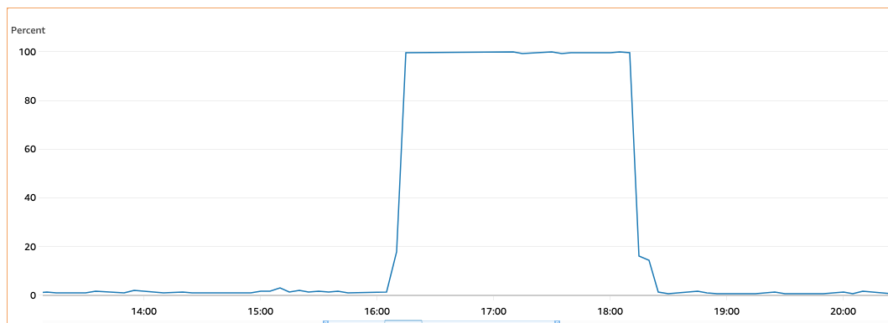

# CloudWatch 경보 + SSM로 서버재부팅

- 현재 충북학사 기숙사 커뮤니티인 돔토리는 AWS 프리티어 범위 안에서 애플리케이션이 구축되어있다. 최대한 가볍게, 최대한 저렴하게 서버를 운영하고 있다.



- 문제는 가끔 t2.micro 인스턴스의 CPU 사용량이 100퍼센트를 웃돌아 서버가 마비가 되는 경우가 있다.
- 오토스케일링을 고려하였지만 프리티어 내에서 해결하고 싶어서 Lambda, cloudwatch를 통해서 재부팅 및 서버 시작을 자동화 시킬 수 있다.

## Lambda 코드

```python
import boto3

def lambda_handler(event, context):
    ec2 = boto3.client('ec2')
    instance_id = ''

    response = ec2.reboot_instances(InstanceIds=[instance_id])
    
    waiter = ec2.get_waiter('instance_running')
    waiter.wait(InstanceIds=[instance_id])
    
    waiter = ec2.get_waiter('instance_status_ok')
    waiter.wait(InstanceIds=[instance_id])

    ssm = boto3.client('ssm')
    commands = [
        'cd /home/ubuntu',
        'docker-compose up -d'
    ]
    
    response = ssm.send_command(
        InstanceIds=[instance_id],
        DocumentName="AWS-RunShellScript",
        Parameters={'commands': commands},
    )

```

- `reboot_instances` 메서드를 통해서 InstanceIds 파라미터의 인스턴스 들을 재부팅시킨다.
- `get_waiter`는 AWS 서비스 리소스의 특정 상태 변화를 기다리는 데 사용
    - EC2의 경우 상태는 다음과 같다
    - `instance_exists`: 인스턴스가 존재할 때까지 대기
    - `instance_running`: 인스턴스가 실행 상태가 될 때까지 대기
    - `instance_stopped`: 인스턴스가 중지 상태가 될 때까지 대기
    - `instance_terminated`: 인스턴스가 종료 상태가 될 때까지 대기
    - `instance_status_ok`: 인스턴스 상태가 정상일 때까지 대기
- 그렇게 `waiter` 객체를 사용해서 인스턴스가 `ok`가 될 때까지 대기한 후 ssm을 통해서 docker-compose up을 해준다.
- `RunShellScript`은 AWS Systems Manager (SSM)에서 제공하는 관리 문서(Managed Document) 중 하나로, EC2 인스턴스에서 쉘 스크립트를 실행할 수 있게 해준다.
    - 다른 종류로는 윈도우 전용 `RunPowerShellScript` 라던가 특정한 작업을 수행하기 위한 Manged Document가 존재한다.

## 기타 설정

### IAM

- 람다는 EC2에 대한 권한, 그리고 EC2의 역할에는 두 가지 정책 연결이 필요하다. 해당 권한이 없으면 **Instances [[instance_id]] not in a valid state for account 'my account id'** 에러가 발생한다.
    - `AmazonSSMManagedInstanceCore`
    - `AmazonSSMFullAccess`

### CloudWatch

- `CPUUtilization`을 지표로 설정하고, 조건에 임계값 유형을 static, 경보의 조건은 95% 보다 큼으로 설정하였다.
- 임계값 유형에서 통계의 종류는 일반적으로 다음과 같다.
    - `Average`: 일정 기간 동안의 CPU 사용률의 평균값을 계산
    - `Minimum`: 일정 기간 동안의 최저 CPU 사용률을 계산
    - `Maximum`: 일정 기간 동안의 최고 CPU 사용률을 계산
    - `Sum`: 일정 기간 동안의 CPU 사용률의 합을 계산
    - `Sample Coun`t: 일정 기간 동안의 샘플 수를 계산
        - boto3의 `cloudwatch.put_metric_data`를 사용하여 지표를 기록할 수 있다.
        - 특정 기간 동안의 데이터 포인트 수를 나타내며, 활동 빈도나 데이터 수집의 신뢰성을 모니터링하는 데 유용
- 작업 구성은 알림에 SNS 구독을 사용할 수 있지만, 간단하게 Lambda 작업에 아까 생성한 Lambda를 연결하는 것만으로도 해결이 가능하다.

## EC2 User Data

- 이렇게 람다 내에서 ssm client를 통해서 명령어를 날릴 수도 있지만, EC2의 User Data를 통해서도 해결이 가능하다.
- User Data는 EC2 인스턴스를 처음 시작할 때 실행할 스크립트나 명령어를 지정할 수 있는 기능
- 즉, User Data에 `docker-compose up`과 같은 서버 시작 스크립트를 지정한 후, cloudwatch 작업 구성에서 **EC2 작업**에서 경보 상태이면 **이 인스턴스 재부팅** 을 설정하면 람다 설정 없이 간편하게 재부팅 및 서버 시작이 가능하다.
- 유의점은 인스턴스의 사용자 데이터를 편집하려면 먼저 인스턴스를 중지해야 하는 번거로움이 존재한다.
- 하지만 람다 작성 없이 콘솔 작업만으로 해당 기능의 구현이 가능하니깐 이 방법도 고려해볼만 하다.