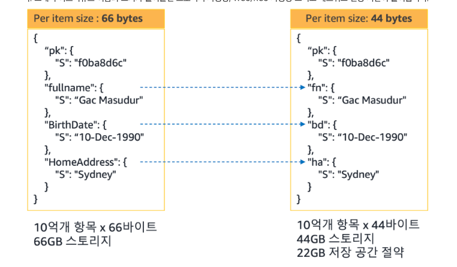

# DynamoDB TIL

## 데이터 불러올 때 boto3 메서드 차이

### `get_item`

- 단일 항목을 검색할 때 사용한다.
- 파티션키와 정렬키는 있는경우를 확실하게 지정해서 하나의 항목만 가져온다.
- 매우 빠르게 데이터를 가져온다. 인덱싱이 아주 잘되어 있는데 심지어 파티션이나 정렬키로 가져오기 때문

```python
response = self._table.get_item(
            Key={'ui': user_id, 'pi': post_id}
        ) 
```

### `query`

- `KeyConditionExpression` 를 사용해서 여러 항목을 검색한다.
- 파티션 키는 반드시 지정해야하고, 정렬 키에 대해서 다양한 조건을 사용할 수 있다.
    - 크거나 같음, 작거나 같음, 사이 값 등등
- 여러 항목에서는 검색 효율이 좋으나 단일 항목은 `get_item` 보다 안좋다.

```python
response = table.query(
    KeyConditionExpression=Key('ui').eq(123) & Key('pi').between(100, 200)
)
```

## 지원하는 데이터 형식

[Amazon DynamoDB에서 지원되는 데이터 형식 및 이름 지정 규칙 - Amazon DynamoDB](https://docs.aws.amazon.com/ko_kr/amazondynamodb/latest/developerguide/HowItWorks.NamingRulesDataTypes.html)

### 새롭게 안 점

- 바이너리는 직접 저장하지는 못하고 `Base64`로 인코딩하고 보내야 한다.
- 맵 형식으로 json을 쉽게 저장할 수 있는데 크기 줄일거면 그냥 압축해서 Base64로 저장시키는 게 좋을 것 같다.
- 몰랐는데 집합 자료형도 지원한다.

## RCU/WCU 란

### RCU

- 읽기는 읽기 작업에 대해 4KB 단위로 과금
- RCU: 데이터를 읽을 때 발생하는 API 용량의 단위
    - 강력한 일관된 읽기:  4KB까지의 항목에 대해 1개의 읽기 단위가 필요
    - 최종적 일관된 읽기: 4KB까지의 항목에 대해 0.5개의 읽기 단위가 필요
    - 트랜잭션 읽기: 4KB까지의 항목에 대해 2개의 읽기 단위가 필요
- 4KB로 과금을 끊는데 강력한 일관된 읽기로 6KB짜리 읽으려면 2 RCU가 필요하다.

### WCU

- 테이블의 데이터를 조작할 때 발생하는 API 용량
- 1KB 아이템 쓰기 요청은 1 WCU
- 츠랜잭션 쓰기는 2WC

## DynamoDB 비용 최적화

[Amazon DynamoDB 비용 최적화 방법 살펴보기 | Amazon Web Services](https://aws.amazon.com/ko/blogs/tech/how-to-optimize-amazon-dynamodb-costs/)



- 대부분의 NoSQL 데이터베이스 모든 어트리뷰트 값을 저장하는 방식의 스키마리스를 제공
- 그래서 어트리뷰트 이름의 크기를 줄이면 스토리지를 비롯한 WCU/RCU 사용량, 네트워크 전송 시간을 줄일 수 있다.
    - ex) user_id → ui, home_address → ha
- 급격한 스파이크나 종일 사용되지 않는 환경에서는 온디맨드를 사용하라.
    - 용량 모드 전환은 무중단으로 하루에 한번만 가능
- 스토리지 비용이 전체의 50%를 넘으면 `Standard-IA` 스토리지 클래스를 고려하라
    - 클래스 변경은 무중단 적용이나 한달에 한번만 가능