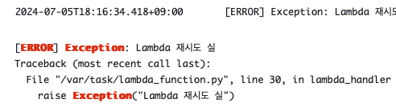
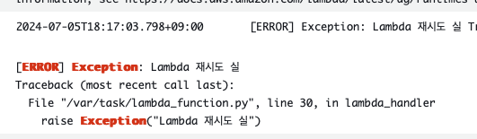
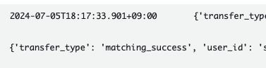

# Lambda와 SQS의 재시도 메커니즘.md

## 람다의 재시도 메커니즘
- 람다 함수는 기본 생성시 비동기식 호출에서 두 번의 재시도를 한다.
- 즉, 만약에 람다에서 에러가 발생하면 1번 + 2번의 재시도를 하여 3번 실행하게 된다.

## SQS의 재시도 메커니즘
- SQS는 메시지를 대기열에서 Trigger 설정이 되어있는 Lambda로 전달할 때, 람다가 메시지를 성공적으로 처리하지 못하면 메시지를 삭제하지 않는다.
- visibility timeout 동안은 다른 consumer가 폴링을 해도 해당 message는 반환되지 않는다.
- 그러다가 visibility timeout 타임 내에 메시지를 처리하지 않으면 타임아웃 이후에 메시지는 다시 큐에 들어가게 된다.
- 다시 큐에 돌아올 때 마다 `ReceiveCount`가 추가된다.
- DLQ(전달 받지 못한 대기열)을 설정하면 **최대 수신 수** 라는 것을 설정하게 되는데, 최대 수신 수는 DLQ로 보내는 `ReceiveCount`의 척도이다.

## 예시
- 만약에 SQS의 DLQ 최대 수신 수를 **2**로 설정하고, Lambda의 함수 재시도 횟수를 **1**로 설정한다.
- 그리고 람다 함수에서 고의로 Exception을 발생시킨다.

```python
sqs = boto3.client('sqs')
dlq_url = ""

def send_to_dlq(message_body):
    response = sqs.send_message(
                QueueUrl=dlq_url,
                MessageBody=json.dumps(message_body),
                MessageGroupId=str(message_body.get('user_id', 'default')),
                MessageDeduplicationId=str(uuid.uuid4())
            )
    return response

def lambda_handler(event, context):
    records = event['Records']
    for record in records:
        body = json.loads(record['body'])
        user_id = body['user_id']
        try:
            if user_id == "1":
                raise Exception("DLQ 실험")
        except:
            print('send to dlq')
            print(send_to_dlq(body))
            
        if user_id == "2":
            raise Exception("Lambda 재시도 실행")
```

- 해당 Lambda는 SQS로부터 메시지를 받아서 user_id가 `1`이면 예외 처리를 통해 DLQ로 전송시킨다.
- 그리고, 재시도 실험을 위해서 user_id가 `2`일 때, 예외를 터뜨린다.

### 결과

- 하지만 막상 로그를 보면 람다 함수 자체에서는 재시도 되지 않은 것을 볼 수 있다.

    

    

    

- 세 사진은 두 개의 Consumer 람다 로그와 한 개의 SQS DLQ Consumer의 로그이다. 타임라인은 다음과 같다.

### 타임라인

- 18시 16분 34초에 첫 번째 에러가 발생
- Lambda 함수가 재시도를 하지 않았고, visibility timeout(30초) 이후에 메시지가 다시 SQS로 돌아감
- 18시 17분 03초에 Lambda 함수가 다시 메시지를 받아 재실행되었고, 다시 실패
- visibility timeout 30초 이후에 메시지가 다시 SQS 큐에 들어갔고, 이때 ReceiveCount가 2가 되어 DLQ(Dead Letter Queue)로 이동

### 이유는? 람다의 비동기식 재시도
- 예상대로라면 첫번째 실패 이후 한번 재시도 설정으로 한번 더 실행 후 실패한다.
- 그리고 나서 visibility timeout 이후에 다시 SQS 큐에 들어가고, 람다가 메시지를 받는다.
- 이후 첫번재를 반복해여 총 4개의 에러 로그를 기대하였다.
- 하지만 정작 재시도는 이루어지지 않은 채로 2번의 에러로그만 발생했는데 이유는 공식 문서에서 찾을 수 있었다.

```
Lambda는 함수의 비동기 이벤트 대기열을 관리하고 오류를 다시 시도합니다.
함수가 오류를 반환하면 Lambda는 함수를 두 번 더 실행하려 합니다.
이때 첫 두 시도 간에는 1분의 대기 시간이 있으며, 두 번째와 세 번째 시도 간에는 2분의 대기 시간이 있습니다.
```
[출처 -  AWS 공식 문서](https://docs.aws.amazon.com/ko_kr/lambda/latest/dg/invocation-async.html)

- 즉, visibility timeout이 기본 30초이기 때문에 람다가 1분 텀으로 재시도 되기 전에 이미 SQS로 돌아갔기 때문이다.
- 굳이 재시도를 원하지 않으면 SQS의 visibility timeout과 DQL 최대 수신 수 만으로도 SQS 만으로도 재시도를 시도해도 나쁘지 않겠다.
- 비동기식 호출 재시도는 한 람다에서 다른 람다를 event 형식으로 invoke 할 때 설정하면 되겠다.
