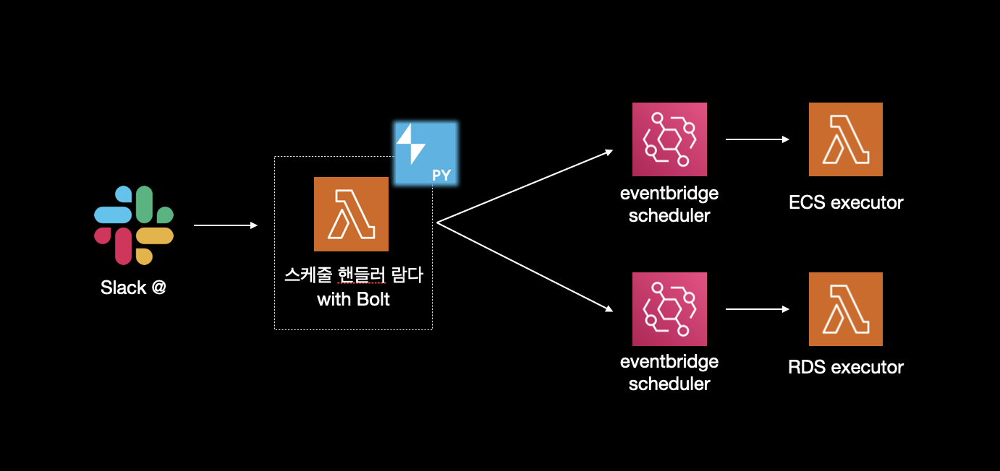

# Slack으로 ECS, RDS 스케줄링 하기

## 문제 상황

- 현재 서비스의 특징상 서버가 불안정해지는 이유는 스파이크 트래픽이 대부분이다.
- 오픈 예정 상품 중에서 인기 있는 상품이 있을 때 사람들이 몰린다.
- 오토스케일링을 설정해보았지만, 스파이크 트래픽 특성상 100% 대비를 할 수 없었다.
    - 현재 오로라를 사용하고 있는데, 리드 레플리카를 하나를 만드는 데 최소 15분 이상이 걸렸다.
    - ECS 또한 CPU Utilization의 임계치를 낮춰서, 40%가 되어도 서비스 수를 늘리게 했지만, 급격히 상승하는 트래픽을 따라가기에는 한계가 있었다.
- 따라서 현재는 다음과 같은 방법으로 스파이크 트래픽을 대비하고 있다.
    - 매일 마다 해당 날짜의 오픈 예정인 상품들 중에서 조회 수가 많은 상품들을 뽑아 매일 슬랙으로 보내주고 있다.
    - 해당 시간에 오로라 리드 레플리카와 ECS 서비스의 태스크 수를 확장시켜준다.
- 이 방법은 중대한 문제점이 있는데, 그것은 해당 시간에 직접 대기하면서 수동으로 늘려줘야 한다는 것이다.
- 너무 번거롭고, 쓸데 없는 리소스가 낭비하기에 이를 자동화 해주고 싶었다.

## 요구 사항

- 특정 시간에 ECS 서비스 태스크 수와, Aurora의 read replica를 자동으로 늘려줘야 한다.
- 스케줄링에 따로 UI는 두지 않고, 슬랙 멘션을 통해서 스케줄링을 진행해준다.
- 람다와 이벤트 브릿지를 사용한다.

## 아키텍처



- 인기 상품 알림 스레드에서 `@봇 + command` 를 통하여 이벤트를 생성한다.
- Slack의 python sdk와 Bolt를 사용하는 람다가 `event subscriptions`을 핸들링한다.
- 해당 람다는 스케줄링하고자 하는 상품을 본문에서 파싱하고, 실제 서비스 태스크 수와 레플리카 수를 조정하는 람다를 호출하는 EventBridge Scheduler를 생성한다.
- 시간이 되면 EventBridge Scheduler는 payload와 함께 executor 람다를 호출하여 실제 레플리카 수를 조정한다.

## 구현

### 스케줄 핸들러 람다

- 우선 이벤트 핸들러 람다에서는 slack sdk와 Slack Bolt를 사용해야 한다.
- slack sdk는 `WebClient`를 통해서 Slack API와 직접 통신한다.
    - ex) `chat_postMessage`를 통해서 채널에 메시지를 날린다.
- slack bolt는 slack sdk를 기반으로 만든 상위 프레임워크이다.
    - 이벤트 리스너와 미들웨어 패턴을 제공한다.
    - aws lambda에 맞는 어댑터를 제공한다. ->  `SlackRequestHandler`

```python
from slack_sdk import WebClient
from slack_bolt import App
from slack_bolt.adapter.aws_lambda import SlackRequestHandler

app = App(
    token=os.environ.get("SLACK_BOT_TOKEN"),
    signing_secret=os.environ.get("SLACK_SIGNING_SECRET"),
    process_before_response=True
)
client = WebClient(token=os.environ.get("SLACK_BOT_TOKEN"))

def lambda_handler(event, context):
    try:
        slack_handler = SlackRequestHandler(app=app)
        response = slack_handler.handle(event, context)
        return response
```

- 이렇게 `WebClient`로 슬랙 SDK를 초기화 할 수 있고, 이를 통하여 특정 스레드의 글을 읽어온다거나, 메시지를 보낼 수 있다.
- `App` 을 통해서 Bolt를 초기화하고, `@app.event("app_mention")` 데코레이터를 통해서 특정 이벤트에 대응하는 함수 작성이 가능하다.
- `SlackRequestHandler`라는 람다 어댑터를 통해서 람다 환경에서 손쉽게 `event subscriptions`을 핸들링 할 수 있다.

```python
@app.event("app_mention")
def handle_mention(body, logger):
    event = body["event"]
    channel_id = event["channel"]
    thread_ts = event.get("thread_ts")
    current_ts = event["ts"]
    text: str = event.get('text')
    
    ...

    if thread_ts:
        product_time_mapping = get_time_list(channel_id, thread_ts)
        message = schedule_with_command(product_time_mapping, is_auto, int_commands)
```

- 이후 멘션을 핸들해주는 함수에서 `@봇 command`시 command를 파싱해주어 스케줄 함수로 전달해준다.
- `get_time_list`에서 태그된 스레드의 글을 읽고, 상품이 게시되는 시간을 리스트로 가져온다. 여기에서 스케줄러 이름을 정하기 위해 상품의 번호도 같이 mapping하여 가져온다.
- 스케줄 함수에서는 아까 파싱한 커맨드를 받아서 얼마나 인스턴스를 늘릴지, 이름은 어떻게 할지와 자동으로 계산해준 스케일 아웃 시간, 스케일 인 시간을 받아서 `boto3`의 `create_schedule`을 통해서 이벤트 브릿지 스케줄러를 생성해준다.

```python
def schedule_with_command(product_time_mapping, is_auto: str, commands: list[int]) -> str:
    OPEN_TIME = product_time_mapping[commands[0]]['time']
    AUTO = True if is_auto == "auto" else False
    if AUTO:
        ecs_calculated_time = auto_calculate_ecs_time(OPEN_TIME)
        rds_calculated_time = auto_calculate_rds_time(OPEN_TIME)

    ecs_request = ECSScheduleRequest(
        target_count=commands[1],
        schedule_name=str(product_time_mapping[commands[0]]['product_id']),
        type="ecs",
        start_at=ecs_calculated_time[0],
        end_at=ecs_calculated_time[1],
        env=os.environ.get('ENV')
    )

    ...

    ecs_success, rds_success = True, True
    ecs_success = create_eventbridge_rule(ecs_request, arn_mapping[ecs_request.type])
```

- 스케줄러 생성시 `ActionAfterCompletion='DELETE'`를 설정하여 완료되면 스케줄러를 삭제하게 하였다. 

### Executor

- 두 개의 Executor는 간단하다. 이벤트 핸들러 함수에서 스케줄링을 할 때 같이 설정한 payload를 받아서 실행시 ecs의 태스크 수나 rds의 리드 레플리카 수를 늘려주기만 한다.
- ecs는 목표 개수를 받아서 boto3의 `put_scaling_policy`를 사용하여 클러스터의 서비스 내 태스크 개수를 늘려주거나 줄여주었다.
- rds에서는 payload의 command가 `add` 일 때 `hot-i` 라는 이름의 리드 레플리카를 생성시키고 `delete` 라는 command를 받으면 `hot-~`으로 시작되는 리드 레플리카를 모두 삭제해주게 하였다.
- 레플리카를 생성할 때 현재 hot으로 시작하는 리드 레플리카가 몇 개인지 세고, +1을 추가하여 레플리카를 만들도록 하였다.

```python
def add_aurora_read_replicas(count: int, cluster_identifier: str, instance_class: str) -> None:
    rds_client = boto3.client('rds')
    response = rds_client.describe_db_clusters(DBClusterIdentifier=cluster_identifier)
    current_instances = response['DBClusters'][0]['DBClusterMembers']
    
    current_hot_count = sum(1 for instance in current_instances if instance['DBInstanceIdentifier'].startswith('hot'))
    
    for i in range(count):
        new_instance_identifier = f'hot{current_hot_count + i + 1}'
        
        print(f"Adding read replica: {new_instance_identifier}")
        
        response = rds_client.create_db_instance(
            DBInstanceIdentifier=new_instance_identifier,
            DBInstanceClass=instance_class,
            Engine='aurora-mysql',
            DBClusterIdentifier=cluster_identifier,
            PubliclyAccessible=False
        )
```

- hot 인스턴스를 삭제하기 위해서는 `delete_db_instance`를 사용하였다.

```python
def remove_aurora_hot_read_replicas(cluster_identifier: str) -> None:
    rds_client = boto3.client('rds')

    response = rds_client.describe_db_clusters(DBClusterIdentifier=cluster_identifier)
    instances = response['DBClusters'][0]['DBClusterMembers']
    
    for instance in instances:
        instance_identifier = instance['DBInstanceIdentifier']
        if instance_identifier.startswith('hot') and not instance['IsClusterWriter']:
            response = rds_client.delete_db_instance(
                DBInstanceIdentifier=instance_identifier,
                SkipFinalSnapshot=True
            )
```

- 레플리카 이름이 'hot' 으로 시작하고, `IsClusterWriter` 가 아닐 때 해당 레플리카를 삭제하게 해주었다.

## 작동 모습


- 이렇게 인기 상품 슬랙이 올라오면


- 해당 스레드에 멘션과 command를 댓글로 단다.


- event bridge 스케줄러 콘솔에 들어가면 스케일 아웃 스케줄러 두개와 스케일 인 스케줄러 두개가 생성되고


- 이렇게 각각 스케줄러에 알맞는 페이로드까지 잘 설정된 것을 확인할 수 있다.

## 이후 개발 예정

- 슬랙을 통해 즉시 인스턴스 수를 늘려주는 커맨드
- 현재 스케줄링 되어있는 이벤트 브릿지 스케줄러 리스트 목록
- 스케줄러를 삭제하는 커맨드
- 커맨드 고도화
    - `--auto`, `--ecs`, `--rds`, `--time 2024-10-28 16:00:00` 이런 식으로 고도화 시킨다.
    - 앞쪽에는 `create`, `list`, `delete` 이런 식으로 멘션시 라우팅을 도와준다.