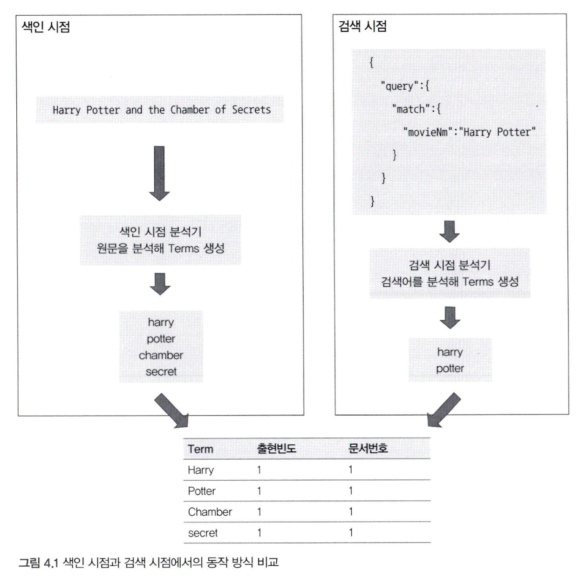
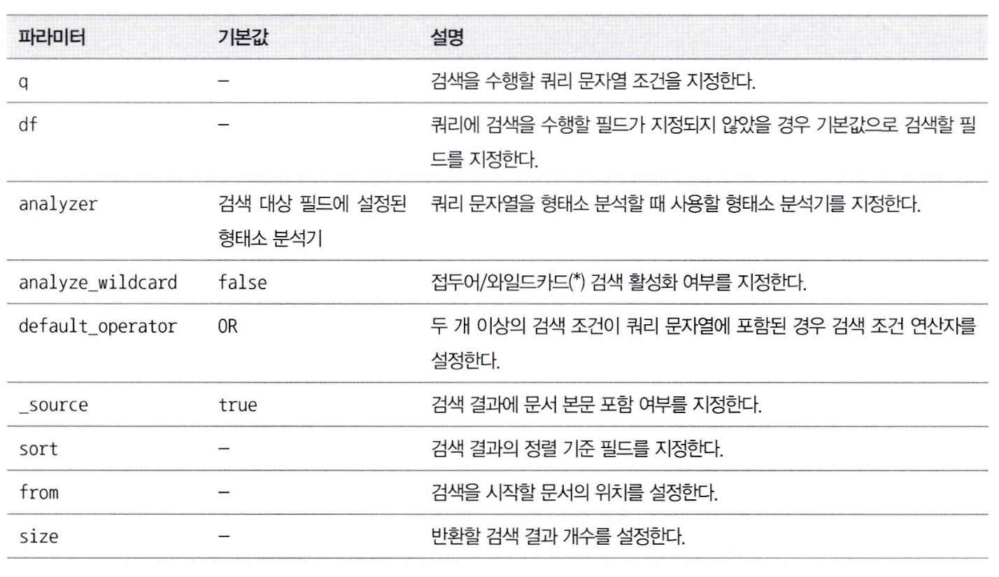
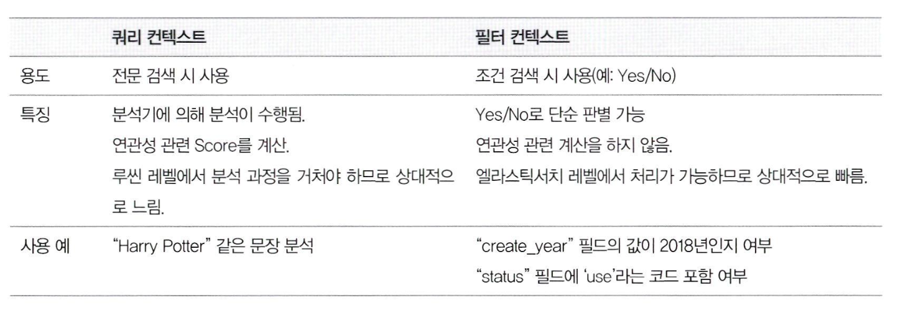
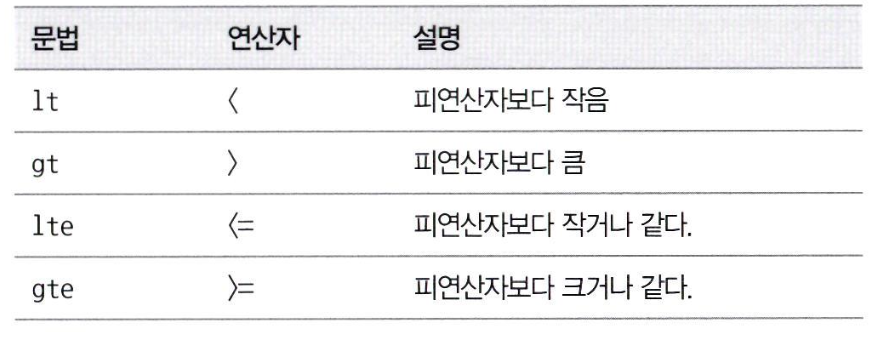

# 데이터 검색
- 분석기는 색인시, 검색시에도 사용이 가능하다.
- 문장이 요청되면 분석기로 토큰의 일치 여부를 판단하여 점수를 매긴다.
- Query DSL(도메인 전용 언어)이라는 쿼리 문법을 제공

## 검색 API
- 색인 시점의 Term을 어떻게 검색 시점에 알 수 있을까?

- 색인 시점에 분석기를 통해 분석된 텀을 역색인 구조로 내부에 저장
- 검색 시점에는 분석이 가능한 경우 분석기로 분석 수행
- 이를 통해 텀을 얻고 역색인 구조를 이용해 문서를 찾는다.
### 검색 질의 표현 방식
- URI 검색
    - GET `movie_search/_search?q=prdtYear:2018`
    - 키 벨류로 전달
- Request body 검색
    ```json
    POST movie_search/_search
    {
        "query": {
            "term": { "prdYear": "2018"}
        }
    }
    ```
### URI 방식
- 복잡한 질의문 입력하기 힘들다.
- 빠르게 테스트 할 수 있다.
- 자주 사용하는 파라미터

- 쿼리 문이 조그만 길어져도 가독성이 떨어진다.
### Request Body 검색
## Query DSL 이해하기
### 구조
- Json 기반
- 요청 형식
```json
{
    "size": , // 결과의 개수
    "from": , // 몇 번째 문서부터 가져올지?
    "timeout": , // 결과 받는 데까지의 시간
    "_source": {}, // 검색시 필요한 필드만 출력하고 싶을 때
    "query": {}, // 검색 조건문
    "aggs": {}, // 통계 및 집계를 사용할 때
    "sort": {} // 정렬 조건
}
```
### 쿼리와 필터
- 쿼리 컨텍스트와 필터 컨텍스트 차이점

- 쿼리 컨텍스트
    - 문서가 쿼리와 얼마나 유사한가?
    - 요청할 때 마다 루씬을 이용해 계산 수행, 캐시 X
    - 전문 검색에 많이 쓰인다
    - 캐싱되지 않는다. 느리다.

- 필드 컨텍스트
    - 쿼리의 조건과 문서가 일치하는가 Yes/No 구분
    - 스코어 계산 X, 단순 매칭 여부 검사
    - 내부적 캐싱
    - 메모리 연산

### 주요 파라미터
- Multi Index 검색
    - 요청시 `,` 를 이용해서 다수의 인덱스명 입력
        - POST `movie_search,movie_auto/_search`
    - 와일드 카드도 가능
        - POST `/log-2019-*/_search`
- 쿼리 결과 페이징
    - from과 size를 사용.
    - from 0, size 5 -> from 5, size 5 로 페이징
    - 그러나 데이터베이스 처럼 **5개만 읽어오는 것이아니라 전체를 읽어 온다.**
- 쿼리 결과 정렬
    ```json
    "sort": {
        "prdYear": {
            "order": "asc"
        }
    }
    ```
    - 스코어 값이 같은경우 두번째 정렬을 사용 가능
- _source 필드 필터링
    ```json
    "_source": [
        "movieNm"
    ]
    ```
    - 리스트 안 필드만 검색 결과에 포함된다.
- 범위 검색
    - 범위 연산자
    
    - "range"를 사용한다
- operator 설정
    - 텀과 텀 사이는 or가 기본, `"operator": "and"`로 명시적으로 지정 가능
    - "자전차왕 엄복동" 에서 and로 할 시 두 개의 텀이 모두 존재해야 결과로 제공
- minimum_should_match 성공
    - 텀의 개수가 몇 개 이상 매칭될 때만 검색 결과로 나오게 하는가?
- fuzziness 설정
    - Match 쿼리를 유사한 값을 갖는 Fuzzy query로 변경 가능
    - "Fli high"를 검색해도 "Fly High"로 검색이 가능
    - 한글은 힘들다
- boost 설정
    - 가중치 부여
    - `"fields": ["movieNm^3", "moiveNmEn"]` -> 한글에서 검색되면 3배의 가중치를 준다.
## Query DSL의 주요 쿼리
- Match All Query
    - `match_all`: 색인에 모든 문서를 검색하는 쿼리
- Match Query
    - `match`: 문장을 형태소 분석을 통해 텀으로 분리하여 텀을 이용해 검색 수행
- Multi Match Query
    - 여러 개의 필드를 대상으로 검색
- Term Query
    - 별도의 분석 작업을 하지 않고 텍스트가 존재하는 문서를 찾는다.
    - keyword 데이터 타입은 Term Query를 사용해야한다.
    - 대소문자 같은 것 주의
- Bool Query
    - `"bool": {"must": [], "must_not": [], "should": [], "filter": []}`
    - 각 AND, NOT AND, OR, IN
- Query String
    - 기본적으로 내장된 쿼리 분석기
- Prefix Query
    - 접두어가 있는 모든 문서를 검색
- Exists Query
    - null이 아닌 값을 찾는 쿼리 (실제 값이 존재하는 문서만 찾고 싶다면)
- wildcard Query
    - 와일드 카드와 일치하는가? 형태소 분석은 이뤄지지 않는다.
    - `*`: 길이와 상관없이 일치
    - `?`: 특정 위치에 한 글자가 다른 경우
- Nested Query
    - 분산 데이터 환경에서 SQL과 유사한 기능을 수행
    - 참고로 엘라스틱서치는 Parent와 Child 문서가 모두 동일한 샤드에 저장
## 부가적인 검색 API
### 효율적인 검색을 위한 환경설정
- 엘라스틱 서치의 검색 요청은 모든 샤드에 요청을 전달하고 기다림 -> 최적화 가능
- 동적 분배 방식 샤드 선택
    - 모든 샤드를 검색하기 때문에 레플리카에서도 값을 가져오면 중복된 값을 가져옴
    - 동일 데이터를 가지고 있는 샤드 중 하나만 선택해서 검새 가능
    - 라운드로빈, 스레드 풀, 응답시간 등등 동적 결정 가능
- 글로벌 타임 아웃 설정
- Search Shards API
    - 몇 개의 노드와 몇 개의 샤드에 있는지 확인
- Multi Search API
    - 여러 건의 검색 요청을 통합해서 한번에 요청, 한번에 결과를 받아온다.
- Count API
    - 검색된 숫자가 몇개인가? 확인할 때 사용
- Validate API
    - 쿼리를 실행하기에 앞서 쿼리가 유요하게 작성 됐는가 검증
    - `_validate`를 포함, 그리고 `rewrite=true`를 적으면 상세한 이유를 알려줌
- Explain API
    - _score 값이 어떻게 계산된 것인가?
- Profile API
    - 실제 쿼리가 수행된 샤드별로 프로파일 정보를 제공
    - 쿼리의 종류, 각 샤드마다 몇 건의 문서가 매칭됐는지, 검색에 수행된 시간은 어떤지 정보 제공
    - 내 질의를 실행하는 과정에서 각 샤드별로 얼마나 많은 시간이 소요됐는가?