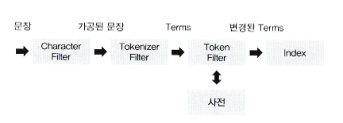

# 데이터 모델링
- 문서의 유형에 따라 필드에 적절한 데이터 타입을 지정해야 한다.
- 매핑 = 색인될 문서의 데이터 모델(스키마)
- 설정 하지 않으면 엘라스틱 서치에서 자동으로 할당, 그러나 이건 나중에 문제를 일으킴
## 매핑 API의 이해
- 한번 생성된 매핑의 타입은 변경할 수 없다.
- 고려사항들
```plain
- 문자열을 분석할 건가?
- _source에는 어떤 필드를 정의?
- 날짜 필드를 가지는 필드는 무엇?
- 매핑에 정의되지 않고 유입되는 필드는 어떻게 처리할 것인가?
```
- 분석 가능 = text
- 계층 구조는 보통 object -> keyword
- 나머지 그냥 조회하는 것들은 integer, keyword 등으로 정의
### 매핑 파라미터
- 색인 할 필드를 어떻게 저장할 것인가?
- analyzer: 데이터의 형태소를 분석할 것이다. -> text 타입의 필드는 이 매핑 파라미터를 기본으로 사용
- normalizer: term query에 분석기를 사용하기 위해 사용 (cafe, Cafe, CaFe)
- boost: 필드에 가중치 부여 -> 최근 제거됨
- coerce: 자동 변환을 허용할지?
- copy to: 추가한 필드의 값을 지정한 필드로 복사 -> 두 데이터를 합쳐서 전체 검색 용도로 사용하기도 함
- fielddata: 힙 공간에 생성하는 메모리 캐시 -> GC 문제로 거의 사용되지 않음
- doc_values: 기본 캐시, text 필드 제외 모두 이 캐시 사용, 힙 사용 부담 없앰
- dynamic: 동적 생성 or 생성 X 할 것인지
- enable: 검색 결고에는 포함하고 싶지만 색인은 하고 싶지 않은 경우 (날짜와 같은 경우)
- format: 날짜 포맷 변경
- ignore_above: 지정한 크기 넘으면 빈 값으로 색인
- ignore_malformed: 잘못된 데이터 타입 색인 -> 예외 발생
- index: 필드 값을 색인할지를 결정
- fields: 다중 필드를 설정할 수 있는 옵션 -> 하위로 멀티 필드를 둔다. (타입 다중화 가능, keyword + text)
- norms: _score 값 계산에 필요한 정규화 인수를 사용할지? -> 이해 X
- null_value: null 이더라도 필드를 생성
- position_increment_gap: 리스트 데이터 색인할 때, 단어와 단어 사이의 간격을 허용할 것인지?
- properties: 중첩 타입, 오브젝트 타입의 스키마를 정의할 때 사용
- search_analyzer: 다른 분석기를 사용하고 싶은 경우 분석기를 별도로 지정 가능
- similarity: 유사도 측정 알고리즘 지정
- store: 필드의 값을 저장해 검색 결과에 값을 포함하기 위한 매핑 파라미터
## 메타 필드
- _index: 인덱스의 이름, 호출시 인덱스에 몇 개의 문서가 있는지 확인 가능
- _type: 매핑 타입 정보를 담고 있음
- _id: 고유 값
- _uid: 식별 값, _type과 _id를 # 로 조합해 사용
- _source: 문서의 원본 데이터 제공, _reindex API나 스크립트를 통해서 해당 값을 재색인 가능
- _all: 색인에 사용된 모든 필드의 정보를 가진 메타 정보 -> 크기가 너무 커져서 폐기, `copy_to` 를 사용하라
- _routing: 특정 문서를 특정 샤드에 저장하기 위해 사용자가 지정하는 메타 필드
## 필드 데이터 타입
- Keyword: 세 가지의 경우 반드시 Keyword 타입 사용
    - 검색시 필터링 되는 항목
    - 정렬이 필요한 항목
    - 집계 해야 하는 항목
- Text: 기본적으로 문자열 데이터로 인식하고 이를 분석
    - 전체 텍스트가 토큰화 되어서 부분 검색 가능
    - 그런데 정렬이나 집계연산이 필요할 경우 keyword과 멀티 필드로 설정 -> fields 사용
- Array: Array 타입 안에는 모두 같은 타입이어야 한다.
- Numeric: 숫자타입, long, integer, short, byte, douvle, float, half_float
- Date
- Range: gte, lte로 시작과 종료 값의 범위를 지정해 줄 수 있다.
- boolean
- Geo Point: lat, lon으로 지정
- IP
- Object: 내부 객체를 계층적으로 포함 가능, 타입 정의를 하지 않고 단지 필드 값으로 구조를 입력
- Nested: 리스트 저장시 or 의 특징 때문에 전부 검색되는 일을 방지 가능
## 엘라스틱 서치 분석기
- 텍스트를 분석할 때 그냥 두면 `standard analyzer` 사용, 그렇게 되면 형태소 분석을 하지 않음
- 역색인 구조
```plain
- 모든 문서가 가지는 단어의 고유 단어 목록
- 해당 단어가 어떤 문서에 속해 있는지에 대한 정보
- 전체 문서에 각 단어가 몇 개 들어있는지에 대한 정보
- 하나의 문서에 단어가 몇 번씩 출현했는지에 대한 빈도
```
- 색인한다 = 역색인 파일을 만든다, 변형을 하더라도 원문을 바꾸는 것이 아닌 `토큰` 만 변경 하는 것. (예를 들어 모두 소문자로 바꿔서 저장)
### 전체 분석 프로세스

- Character filter: 특정 단어를 변경, HTML 태그 제거 등
- Tokenizer filter: 텍스트를 어떻게 나눌 것인지?
- Token filter: 토큰화된 단어를 하니씩 필터링, 사용자가 원하는 토큰으로 만든다.
- _analyzer: analyzer에 따라서 형태소가 어떻게 되는지 볼 수 있다.
### 대표적 분석기
- Standard Analyzer: 공백, 특수 기호를 기준으로 토큰 분리, 모든 문자를 소문자로 변경
- Whitespace Tokenizer: 공백 문자열을 기준으로 토큰 분리
- keyword tokenizer: 전체 입력 문자열을 하나의 키워드처럼 처리
### 전처리 필터
- 토크나지어 내부에서도 잘 해주기 때문에 잘 쓰이지 않음
- html strip char 필터: html을 제거하는 전처리 필터
### 토크나이저 필터
- 토크나이저 필터에 따라서 적절히 분해된다.
- standard 토크나이저: 기호를 만나면 토큰으로 나눈다.
- whitespace tokenizer
- ngram 토크나이저
- edge ngram 토크나이저
    - hello harry -> he, hel, hell, hello, ha, har, harr, harry
- keyword 토크나이저: 텍스트 하나를 토큰으로 만든다
### 토큰 필터
- 분리된 토큰을 변형하거나 추가, 삭제할 때 사용됨
- Ascii folding 토큰 필터: 127개의 알파벳, 숫자, 기호에 해당하지 않으면 아스키 요소로 변경
- lovercase 토큰 필터: 전체 문자열 소문자로
- upper case 토큰 필터
- stop 토큰 필터: 불용어로 등록할 사전을 구축해서 사용하는 필터를 의미
- stemmer 토큰 필터: stemmer 알고리즘 활용, 영단어 원형으로 변환되는지 확인
- synonym 토큰 필터: 동의어 처리 필터
- Trim 토큰 필터: 앞뒤 공백 없애는 필터
### 동의어 사전
- elastic search를 검색했을 때 엘라스틱 서치로도 검색 가능되도록
- 대부분 config 파일로 사전을 만든다.
- 동의어 추가, 동의어 치환이 있다.
