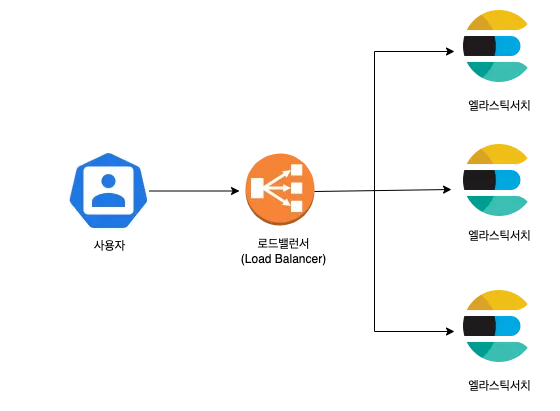
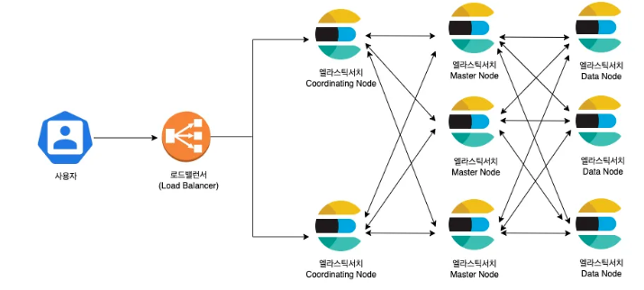
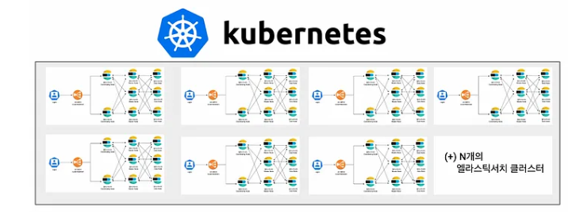

# 무신사의 엘라스틱 서치
- 무신사에서는 통합 검색 및 로그 검색을 위한 일부 팀에서만 사용
- 회원 후기팀, 스냅 팀 등 엘라스틱 서치에 대한 요구사항이 늘어남

## 무신사의 엘라스틱 서치 역사
- 5.x 버전 ~ 8.x 버전을 거쳐감

## 초기 무신사의 엘라스틱 서치 구성

### v1

- 총 3대의 엘라스틱 서치 노드를 1개의 클러스터
- 클러스터는 3대의 검색노드로, 데이터 노드에 마스터의 롤까지 정의
- 이 때의 검색 엔진은 CMS GC를 사용 -> Stop the world가 빈번했음

### v2

- 엘라스틱 서치 7.x
- 가비지 컬렉션이 G1GC 형식으로 변경 -> Stop the world가 줄었음
- 노드의 역할을 분리
    - 마스터, 데이터, 코디네이팅
- 정교한 검색을 위해서 무신사의 커스텀 형태소 분석기 설치

### v3
- 서비스 별로 클러스터 분리
- shard allocation awareness를 사용
    - 노드 속성으로 데이터를 저장하는 샤드의 위치를 사용자가 직접 할당을 지정할 수 있는 속성
- AWS lambda를 사용하여 오토스케일링 구현

## 엘라스틱 서치 생성 방법에 대한 고민
- EC2에 설치를 위한 인프라 작업 = 반복적임, 번거로움
- 클라우드로 눈을 돌림

## AWS OpenSearch
- 장점
    - 콘솔 클릭 만으로 새로운 도메인 생성
    - 인스턴스 수, 유형, EBS 볼륨 쉽게 지정 가능
- 단점
    - 한국어 서비스 호환이 잘 안됨
    - nori가 아닌 은전한닢 사용
    - 버전의 제약이 존재

## 엘라스틱 클라우드
- 엘라스틱사에서 직접 제공하는 SaaS 형태의 엘라스틱 서치
- 장점: 엘라스틱사의 공식 기술 지원, 운영 오버헤드 줄여줌
- 단점: 💸

## ECK(Elastic Cloud on Kubernetes)


- 엘라스틱에서 제공하는 ECK 플랫폼 제공
    - 엘라스틱 서치, 키바나를 K8s 환경에서 관리하도록 지원
- 원하는 클라우드에 직접 쿠버네티스에 엘라스틱서치 구성 가능
- Opensearach Service보다 저렴, 빠르게 확장 가능
- 무신사는 이미 EKS를 사용 중이었음. -> MusE라는 새로운 플랫폼 이름으로 검색엔진 구축

## MusE
- 사전 동기화
    - S3에 사용자 사전, 동의어 사전, 금칙어 사전을 저장. 엘라스틱 서치 노드와 사전 동기화가 가능했다.
    
    ```
    // synonym.txt

    가디건, 카디건
    ```
    - 원래 해당 파일을 모든 노드마다 가지고 있어야 했는데, aws cli 중 `aws s3 sync`를 사용해서 노드 내 config/dictionary 파일에 동기화
    - 재배포 하지 않아도 동기화 가능 -> 유연
- 버전 업그레이드: ECK 설정 파일만 수정하면 롤링 업데이트 -> 생각보다 간단
- 쿠버네티스의 request, limit을 통해서 리소르 할당을 관리
- 쿠버네티스에 구축 과정은 생략 .. ..

## 결론
- ECK의 설정 파일을 Helm으로 템플릿화하여서 원하는 값만 변경하면 빠르게 클러스터를 구축
- EC2에서 직접 구축할 때 14일 걸리던 것을 10분으로 줄였다.