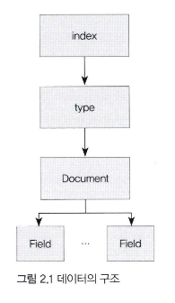
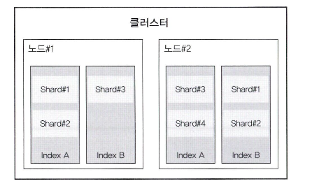
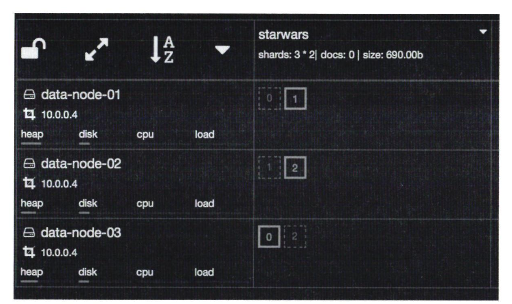

# 엘라스틱 서치 살펴보기
## 기본 용어

- 인덱스
    - 데이터 저장 공간
    - 하나의 타입만 가짐
    - 하나의 물리적 노드에 여러 개 논리적 인덱스 생성 가능
    - 기본적으로 5개의 프라이머리 샤드, 1개의 레플리카 샤드 생성
    - 이름은 모두 소문자
- 샤드
    - 인덱스 안의 파티션
- 타입
    - 인덱스의 논리적 구조
    - 현재는 인덱스를 여러 개 만드는 것을 권장
- 문서
    - 데이터가 저장되는 최소 단위
    - json으로 데이터 저장
- 필드
    - 문서를 구성하기 위한 속성
    - DB의 칼럼, 그러나 동적임
- 매핑
    - 문서의 필드와 필드의 속성을 정의, 그에 따른 색인 방법 정의

## 노드 종류
마스터노드, 데이터 노드, 코디네이팅 노드(사용자 요청 받는 노드), 인제스트 노드(문서 전처리 작업)

## 클러스터, 노드, 샤드

- 클러스터는 인덱스의 문서를 조회할 때 마스터 노드를 통해서 2개의 노드를 조회하여 데이터를 취합한다.
- 프라이머리 샤드3, 레플리카 샤드1로 구성하면 다음과 같은 구성이 된다.


## 주요 API
- 문서를 색인하기 위해서는 indices를 생성
- 스키마리스는 가급적 사용하지 말자.
    - 누락되거나 용량 측면에서 불리함

### 인덱스 관리 API
- 인덱스 생성시 매핑이라는 세부 설정을 이용
- 그러나 설정 이후로는 바꿀 수 없다
- `PUT /movie`로 다양한 타입들을 설정한다. `keyword`는 기본 문자열이고, 형태소 분석을 위해서는 `text` 타입으로 설정한다.

### 문서 관리 API
- 실제 문서를 색인하고 조회, 수정, 삭제하는 API
- single document API, multi-document API가 있음
- 문서 생성: `POST /movie/_doc/1`
- 문서 조회: `GET /movie/_doc/1`
- 문서 삭제: `DELETE /movie/_doc/1`
- 여기서 ID를 설정하지 않으면 UUID 값으로 들어감
- 근데 데이터 베이스랑 연동시 UUID로 설정하면 동기화 문제가 생기기 때문에 되도록 데이터베이스의 PK랑 맞춰주자

### 검색 API
- HTTP URI 형태의 파라미터 vs Request Body -> 보통 후자로 사용, 두 개를 섞는 방법도 OK
- URI 방식
    - `GET /movie/_doc/id?pretty=true` -> 전체 조회
    - 특정 용어를 찾고 싶을 때 `POST /movie/_search?q=단어` or `POST /movie/_search?q=필드명=단어`
- Request body 방식
    ```javascript
    POST /index명/_search
    {
        size: 몇 개 결과
        from: 어느 위치부터?
        _source: 특정 필드만 결과로 반환
        sort: 특정 필드 기준으로 정렬
        query: {
            "term": {"필드명": "검색어"},
        }
        filter: {
            검색 결과 중 특정 값을 다시 보여줌
            결과 내 재검색
        }
    }
    ```
### 집계 API
- 메모리 기반으로 동작
- 버킷 안에 버킷을 중첩가능, 즉 검색 결과 내 검색이 가능하다는 소리
- 버킷 집계, 메트릭 집계, 매트릭스 집계, 파이프라인 집계의 종류가 있다.
