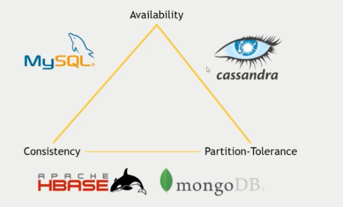
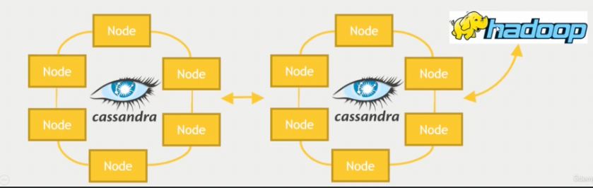

# 카산드라
- Nosql, 분산데이터 시스템이지만 단일 실패 지점이 없다.
- 마슴터 노드가 없다 -> 전부 같은 수준의 노드
- 꼬인 nosql, 결합이나 정규화는 없다.
- 대용량 데이터를 보내는데 고가용성, 거대한 처리양, 고확장상을 목표
- CQL이라는 쿼리 언어를 가지고 있다. -> 비관계형 쿼리만 가능(조인이 안됨)

- CAP
    - 일관성: 입력을 하면 언젠가 값을 받는다. -> 궁극의 일관성
    - 가용성: 데이터베이스가 항상 작동, 신뢰할 수 있다.
    - 파티션 저상항: 쉽게 나눠지고 클러스터에 저장된다.
- 카산드라는 이 중에서 파티션과 가용성을 중요시 함
- 조정 가능한 일관성-> 얼마나 많은 노드들이 동의해야 결과를 받아들일 수 있는가?

- 온라인 쿼리용 클러스터, 하둡용 클러스터를 나누고 분석 시스템에 사용한다.
- 키스페이스 = RDBMS의 테이블
- 스파크와 조합이 좋다. DataFrame을 사용할 수 있음
- config에 `config("spark.cassandra.connection.host", "127.0.0.1")` 을 넣는다
