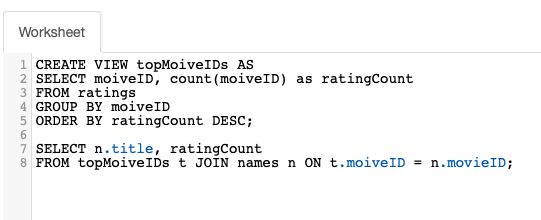
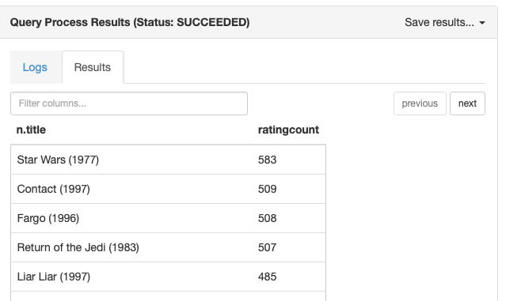
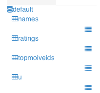

# HIVE
- SQL을 사용해 Hadoop 클러스터에 쿼리를 한다.
- Map reduce나 Tez를 사용한다.
- 익숙한 쿼리 언어를 사용한다는 것이 큰 장점이다.
- 복잡한 쿼리를 `VIEW` 를 사용해 조각들로 나눌 수 있다.
## 적합하지 않은 경우
- 실시간 처리 작업에는 적합하지 않지만, 대용량데이터 세트를 쿼리하는데 적합하다.
- OLTP에 적합하지 않다. `Online Transaction Processing` 고 커치, 저 대기를 원한다면 좋은 선택은 아니다. SQL -> MapReduce를 거치기 때문
- 비정형 데이터베이스를 쓸 때
- 실제 데이터베이스가 아니다. 실제 저장되는 것이 아님

## 실습

- GROUP BY를 하면 count 작업으로 수를 세고 GROUP을 사용해 그 데이터를 클러스터로 만든다.
- 뷰를 이렇게 사용할 수 있다.

- 해당 SQL을 실행하면 VIEW가 실제 테이블 처럼 생성된 것을 볼 수 있는데, `DROP VIEW` 로 없애야 다음 SQL 실행에 지장이 가지 않는다.

## 작동 방식
- 읽기 스키마: 관계형 DB는 쓰기 스키마를 사용한다. 그러나 하이브는 읽기 스키마인데 구조화 되지 않은 데이터를 가져와서 읽는 순간 스키마를 적용한다.
- LOAD DATA: 사용하면 분산 시스템에 데이터를 가져온다. 구조화하는 것이 아니라 스키마 정보를 메타 데이터에 저장하는 것 뽄이고, 데이터를 move 만 한다.
- LOAD DATA LOCAL: 실제 복사본을 만든다.
- 내부 테이블 vs 외부 테이블: 다른 시스템과 공유가 필요할 때 CREATE EXTERNAL TABLE을 사용한다. 이 데이터는 HIVE를 사용하지만 소유하지는 않는다.

## 파티셔닝
추후 추가 필요

## SCOOP
- 기존의 데이터베이스를 하둡으로 보내는 것
- Mysql -> Mapper -> Hadoop
- `sqoop import --connect jdbc:mysql://localhost/moivelens --driver com.mysql.jdbc.Driver --table moives` 로 쉽게 불러올 수 있음
- `-m` 을 통해서 매퍼 개수를 정할 수 있음. 우리는 `-m 1`를 붙임
- hive import를 하려면 `--hive-import` 를 붙이면 됨
- 증분적 불러오기도 가능. --check-column and --last-value
- Hive에서 mysql로도 보낼 수 있다. `sqoop export --connect jdbc:mysql://localhost/moivelens -, 1 --driver com.mysql.jdbc.Driver --table exported_moives --export-dir /apps/hive/warehouse/movies --imput-fields-tertminated-by '\0001'`
- 테이블을 사전에 만들어두어야한다.