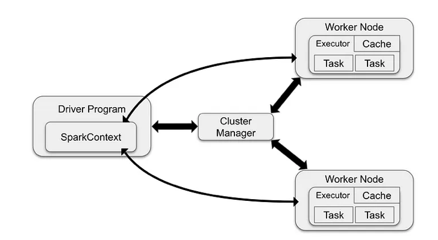

# Spark Cluster 구축기
- 여기어때 기술블로그를 읽고 정리한 글입니다.
https://techblog.gccompany.co.kr/spark-cluster-구축기-3ab223853b74

## 서론
### Spark를 사용한 이유
- 데이터를 가공하는 것이 데이터 엔지니어의 주요 업무
- 데이터 전처리: 데이터 웨어하우스에 적재하기 전, 원시 데이터에서 원하는 형식으로 선택 및 가공하여 처리하는 작업
- 데이터 전처리 및 이관 작업하는데 Spark를 사용

### Spark cluster를 구축한 이유
- EMR을 사용하는 경우도 있지만, 대부분 단일 서버에 Spark를 설치하여 처리
- 서버 메모리 부족 -> 처리 데이터양, 처리 속도에 제한 -> 클러스터 구축 필요

## Spark와 Hadoop은 어떤 관계인가?
- Hadoop은 HDFS + YARN + MapReduce를 사용한 데이터 분산 처리 시스템
- 연산 방식에 차이가 있는데, Hadoop은 Disk I/O를 기반
- Spark는 인메모리 데이터 처리 -> 느린 연산속도 보완
- 일반적인 Spark Cluster는 HDFS + Yarn 리소스 매니저
    - 그러나 S3같은 스토리지를 사용하는 선택지도 있다.
    - 다른 AWS 서비스와 통합할 수 있다는 장점, But 데이터 엑세스 및 처리 속도는 느리다.
- 구축 시행 착오는 생략

## Spark Job은 어떻게 실행되나?
- Spark Job이 실행될 때, Job의 작업단위는 어떻게 되는가?

    - 작업 제출: 스파크 애플리케이션을 마스터노드에 제출
    - 자원 할당: 클러스터 매니저가 애플리케이션 실행에 필요한 자원(메모리, CPU 시간 등)을 Worker Node에 할당하고 Task를 수행하는 Executor 프로세스를 시작. Executor의 위치와 정보를 드라이버 프로세스에 전송함.
    - 작업 실행: Worker Node는 할당된 자원을 사용하여 실제 데이터 처리 작업 수행. Task를 할당 받은 Worker는 Task의 상태와 성공/실패 여부를 드라이버에 전송
    - 결과 반환: Spark애플리케이션 실행이 완료되면 드라이버 프로세스가 성공/실패 중 하나의 상태로 종료. 그런 다음 클러스터 매니저는 클러스터의 모든 Executor를 종료시킴.

## Cluster의 가용성을 높이는 법
- 네임노드를 두 개 띄우고, 하나는 stand by로 사용
- spark job에서 보듯, 마스터 -> 스케줄링, 실패시 전체 시스템이 중단.
- 이 때 스탠바이한 네임노드를 사용해서 고가용성 보장
```linux
hdfs haadmin -getServiceState namenode1 --> active
hdfs haadmin -getServiceState namenode2 --> standby
```
- 스탠바이 네임노드가 바로 대체될 수 있는 이유
    - Hadoop의 저널 노드 매니저와 Zookeeper가 네임노드 상태 동기화
    - 이들이 Active 노드의 장애가 발생하면 Standby Name Node를 리더로 선출
- Spark 자체는 주키퍼나 저널 노드에 의존하지 않는다. 그러나 Spark Cluster가 Hadoop 생태계와 통합되면 이러한 컴포넌트들과 상호 작용
- 추가로 Spark의 Driver와 Executor는 JVM 상에서 실행된다고 한다.

## 그래서 클러스터는 성능이 얼마나 하는가?
- 속도: 2.8 시간 -> 36분
- 데이터 용량: 500GB가 9.8시간 소요

## Trade Off
- 그럼 항상 클러스터가 정답인가? NO
- 단일 서버 환경은 초기 투자 및 유지보수 비용이 낮고, 관리가 편하다.
- 조직의 요구사항과 자원 가용성 고려