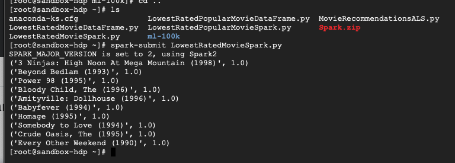

# Spark
- 실제 프로그래밍 언어를 사용해 스크립트를 작성할 수 있는 유연성 제공
- Spark위에 다양한 생태계도 존재함
- 메모리 기반 솔루션
- MapReduce와 100배 빠르다.
- 회복성 분산 데이터 - 데이터 세트를 리듀싱하고 분석해서 새로운 RDD를 만든다.
- Spark Streaming: 실시간 데이터 입력
- Spark SQL: Spark의 SQL 인터페이스
- MLLib: 머신러닝, 데이터 마이닝 관련된 것
- GraphX: 촌수 같은 것
- 결국은 스칼라로 하는 것이 좋다.

## RDD
- 회복성 분산 데이터 세트
- 작업을 분산하고 실패가 생겨도 회복시킨다.
- RDD 만드는 법 Spark Context
```python
nums = sc.paralleize([])
sc.textFile("경로") # -> hdfs:// or s3n:// 가 될 수도 있음 
```
- map: 입출력이 1대 1
```python
rdd = sc.parallelize([1, 2, 3, 4])
squaredRDD = rdd.map(lambda x: x * x)
1, 4, 9, 16
```
- flatmap: 입력행과 출력행 사이의 일대 몇 관계 가능
- filter
- distinct
- sample
- union, intersection, substract

## RDD actions
- collect: RDD 결과물을 입력으로 받아 드라이브 스크립트로 빨아들인다.
- count: RDD의 행을 세어둔다.
- countByValue: 고유의 값이 RDD에 얼마나 있는가
- take:
- top:  RDD내 상위 10개위 데이터를 구하는 데 사용됨
- reduce: 각 고유 키와 관련된 값들을 집계하는 함수를 정의할 수 있다.
- Lazy evaluation
    - RDD애 해다 함수들을 하기 전에는 드라이버 스크립트에서 아무것도 실행하지 않는다.
    - 실행시 스파크는 최적의 경로를 찾아냄
## rdd 실습 결과


## Spark SQL - dataframes and datasets
### DataFrame
- DataFrame은 RDD를 DataFrame 객체로 확장하는 것
- import SQLContext, Row를 하고 hiveContext로 불러올 수 있다.
- show()
- select()
- filter()
- groupBy
- rdd().map() -> 여기서 rdd 수준의 작업이 가능하다.
### DataSet
- Datarame은 열 객체의 DataSet이다.
```python
hiveCtx.registerFunction("square", lambda x: x*x, InteegerType())
df = hiveCtx.sql("SELECT square('soneNumericFiled') FROM talbleName")
```
이렇게 함수를 등록할 수도 있다.
- Spark는 모두 DataSet을 기반으로 한 API를 사용한다.

## Dataframe 실습
```python
from pyspark.sql import SparkSession
from pyspark.sql import Row
from pyspark.sql import functions

def loadMovieNames():
    movieNames = {}
    with open("ml-100k/u.item") as f:
        for line in f:
            fields = line.split('|')
            movieNames[int(fields[0])] = fields[1]
    return movieNames

def parseInput(line):
    fields = line.split()
    return Row(movieID = int(fields[1]), rating = float(fields[2]))

if __name__ == "__main__":
    # Create a SparkSession (the config bit is only for Windows!)
    spark = SparkSession.builder.appName("PopularMovies").getOrCreate()

    # Load up our movie ID -> name dictionary
    movieNames = loadMovieNames()

    # Get the raw data
    lines = spark.sparkContext.textFile("hdfs:///user/maria_dev/ml-100k/u.data")
    # Convert it to a RDD of Row objects with (movieID, rating)
    movies = lines.map(parseInput)
    # Convert that to a DataFrame
    movieDataset = spark.createDataFrame(movies)

    # Compute average rating for each movieID
    averageRatings = movieDataset.groupBy("movieID").avg("rating")

    # Compute count of ratings for each movieID
    counts = movieDataset.groupBy("movieID").count()

    # Join the two together (We now have movieID, avg(rating), and count columns)
    averagesAndCounts = counts.join(averageRatings, "movieID")

    # Filter movies rated 10 or fewer times
    popularAveragesAndCounts = averagesAndCounts.filter("count > 10")

    # Pull the top 10 results
    topTen = popularAveragesAndCounts.orderBy("avg(rating)").take(10)

    # Print them out, converting movie ID's to names as we go.
    for movie in topTen:
        print (movieNames[movie[0]], movie[1], movie[2])

    # Stop the session
    spark.stop()
```
- `SparkSession`의 `getOrCreate()`는 스스로를 회복시킨다.
- `SparkSession`은 context를 불러오지 않고 lines를 불러온다.
- SQL 문법을 쉽게 사용하고 데이터가 더 구조화 되어있다.
