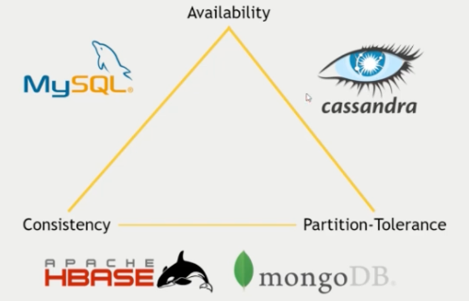

출처: https://www.infoq.com/news/2023/06/discord-cassandra-scylladb/

## 데이터베이스를 선택하는 법

### 1. 어떤 시스템을 통합해야하는가

- 커넥터
    - Apache Spark를 사용한다면 ..

### 2. 확장에 필요한 요구사항 고려

- 데이터의 양
    - 수직적? or 수평적?
- 처리량
    - 초당 얼마만큼의 요청을 처리?
    - 단일 디비 서버? 아니면 분산?

### 3. 필요한 지원

- 구성하고 작동 시킬 내부 전문가가 있는가?
    - 시스템 보안 측면
    - Nosql은 기본 값으로만은 보안이 안된다.
- 기업적 솔루션을 제공하는 MongoDB 추천
- 예산 또한 중요

## CAP

- 일관성
    - 시스템의 모든 노드가 같은 시점에 동일한 데이터, 즉 어떤 데이터를 읽던 항상 최근의 데이터 -> 궁극의 일관성
- 가용성
    - 데이터베이스가 항상 작동하고 신뢰할 수 있는가?
- 파티션 내성
    - 시스템이 네트워크 분할 상황에서도 정상적으로 접근이 되는가?

### 조합

- CP 시스템 (일관성 + 파티션 내성): 네트워크 분할이 발생하더라도 일관성을 유지하지만, 가용성은 보장X
- AP 시스템 (가용성 + 파티션 내성): 네트워크 분할이 발생하더라도 가용성을 유지하지만, 일관성은 보장X
- CA 시스템 (일관성 + 가용성): 네트워크 분할이 발생하지 않는 환경에서 가용성을 유지. 그러나 실제로 네트워크 분할이 발생하면 파티션 내성을 포기
- 그러나 요즘에는 경계가 모호해지고 있다.
    - MYSQL의 샤딩, ScyllaDB

## 중요! ‘간단한 기술과 아키텍처’

- 필요에 맞는, 요구사항에 오버하지 않는 기술을 선택
- `단순함`이 모든 아키텍처 설계의 주요원칙이 되어야 한다
    
    → 최근 네이버, DB 인스턴스의 scale out 보다 scale up을 택하는 경우도 있음
    
    → 다른 예로는 모놀리식 → 마이크로 서비스 아키텍처 → 다시 모놀리식
    

## 디스코드 디비 변천사

### Mongo DB

- 2015년 당시에는 레플리카 세트에 데이터를 저장하는 MongoDB를 사용했다.
- 2016년 → 하루에 1억 개의 메시지가 발생한다.
- 몽고 DB 문제 발생 이유
    - 디스코드는 읽기와 쓰기의 비율이 5:5 → 몽고 DB는 쓰기 연산 비용이 더 많다.
    - 비공개 채팅이 많다 → 캐시 히트가 낮아져서 반응 속도가 느려짐

### Cassandra DB

- 2017년 MongoDB에서 Cassandra로 데이터베이스를 이전
    - 이유는 Cassandra의 확장성, 그리고 선형적 확장 기능
    - 12개의 카산드라 노드로 시작하였으나 2022년 177개의 노드,  메시지는 수 조개
- 성능 문제가 발생
    - 핫 파티션(hot partition) 문제가 빈번하게 발생
    - 핫 파티션은 특정 채널과 시간 버킷 쌍이 많은 트래픽을 받을 때 발생
    - 이로 인해 해당 노드의 지연 시간이 증가하고, 이는 전체 데이터베이스 클러스터에 영향
    - Discord는 **`쿼럼 일관성 수준**(quorum consistency level)`을 사용하여 읽기 및 쓰기를 수행 → 핫 파티션이 발생하면 모든 쿼리가 지연 시간 증가의 영향
    - Mem table에 데이터가 없으면 SSTable에서 파일을 가져와서 읽기 비용이 쓰기 비용보다 많음
    - SSTable 압축에 따른 성능문제도 발생
- 가비지 컬렉션 문제
    - Tombstones
        - Cassandra에서 데이터를 삭제하거나 업데이트할 때, 실제로 데이터가 즉각적으로 제거 않음
        - 대신, 삭제된 항목을 표시하는 특별한 레코드인 'tombstone'이 생성
        - 이 tombstone은 일정 시간 동안 데이터가 삭제되었음을 나타냄.
        - tombstones이 너무 많아지면, 읽기 연산의 성능이 저하될 수 있으며, 이는 가비지 컬렉션 문제로 이어짐
    - Compaction
        - Cassandra는 불필요한 데이터와 tombstones를 정리하기 위해 'compaction'이라는 과정을 이 존재
        - 여러 파일에 흩어진 데이터를 병합하여 새로운 파일을 생성하고, 동시에 불필요한 데이터를 제거
        - compaction 과정은 많은 CPU와 디스크 I/O를 요구하며, 큰 데이터셋을 다룰 때는 시스템에 상당한 부하
        - 특히, compaction이 제대로 수행되지 않을 경우 데이터가 계속 쌓여 가비지 컬렉션 문제가 악화

### ScyllaDB

- ScyllaDB 로의 마이그레이션 결정
- 성능 개선과 Cassandra에서 경험한 가비지 컬렉션 문제 및 핫파티션 해결
    - C++ 로 작성
    - Cassandra 보다 성능도 좋고(10배 정도의 throughput), 완벽한 호환성
    - 자체적으로 로드 밸런싱 → 노드 간 균형
    - 무려 높은 일관성과 높은 가용성을 보임
    - GC가 없음
- 데이터 서비스 계층 도입: 핫 파티션 문제를 줄이기 위해 새로운 데이터 서비스 계층을 도입, Rust로 작성, gRPC API (노드 분산 및 캐싱 사용)
- 마이그레이션 과정
    - ScyllaDB의 Apache Spark 마이그레이터 대신 Rust와 SQLite를 사용한 맞춤형 솔루션을 구현하여 마이그레이션 시간을 3개월에서 9일로 단축