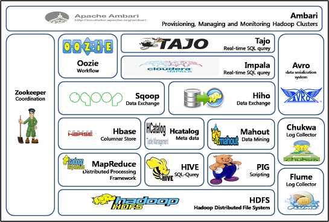

## 개요 및 역사
- 다수의 PC를 활용해 빅데이터를 다룬다.
- 분산 저장과 분산처리를 한다.
- GFS(구글 파일 시스템)은 하둡의 토대이다.
- MapReduce에 영향을 주었다.
- 왜 하둡을 사용할까?
    - 요즘은 데이터가 매우 크다.
    - 이 데이터를 하나의 PC로 처리할 수 없다.
## Hadoop 생태계

- Core hadoop ecosystem
    
    - HDFS: 하둡 분산 파일 시스템
    - YARN: 데이터 처리부분을 담당. 컴퓨터 클러스터의 리소스를 관리하는 시스템이다.
        - MESOS: yarn의 대체자 정도
    - MapReduce: 데이터츨 클러스터 전체에 걸쳐 처리하도록 하는 프로그래밍 메타포, 혹은 프로그래밍 모델
        - Spark: Yarn이나 mesos 어느 것에나 할 수 있음. scala를 추천한다. 
        - tez: 방향성 비사이클 그래프
    - Pig: MapReduce위에 있음. 고수준의 API로 SQL로 쿼리할 수 있게 해줌. 작성된 스크립트를 MapReduce가 읽게 가능하도록 바꿔준다.
    - HIVE: 실제 SQL를 받고 파일 시스템에 분산된 데이터를 SQL 데이터베이스처럼 취급한다.
    - HBASE: 클러스터에 저장된 데이터를 노출한다. 
    - Apache Storm: 실시간 스트리밍 데이터를 처리한다. 
    - Apache Ambari: 클러스터 전체를 보여준다. 리소스 시각화, Hive, pig 쿼리를 실행하거나 클러스터와 그 위에 작동하는 애플리케이션의 상태를 알게해준다.
    - OOZIE: 클러스터의 작업을 스케줄링 해준다.
    - zookeeper: 클러스터의 모든 것을 조직화하는 기술.
    - Sqoop: 하둡의 데이터베이스를 관계형 데이터베이스로 엮어낸다. ODBC, JDBC
    - Flume: 대규모 웹로그를 클러스터로 저장.
    - kafka: PC 혹은 웹 서버 클러스터에서 모든 데이터를 하둡 클러스터로 보낸다.
- External Data Stoage
    - mysql: sqoop을 통해서 sqark를 사용할 수 있다.
    - cassandra: 기둥형 데이터 스토어, 실시간 데이터 처리한다.
    - MongoDB