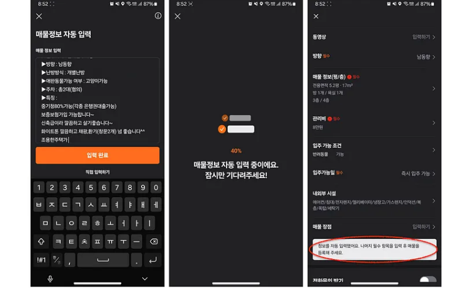

# 당근에서 LLM 활용하기

https://medium.com/daangn/당근에서-llm-활용하기-76131ecebce1

## LLM이 하는 일

- 자연어 처리(텍스트 분석, 추출, 분류)
    - 예전에는 NLP라고 머신러닝과 딥러닝으로 수행했음
    - 그러나 LLM의 간단한 프롬프트 작성만으로 키워드 추출 같은 것이 가능
- 사람의 질문에 대답하기
    - 사람의 질문에 대답하는 Assitant 형태의 서비스 가능
    - 문서나 DB등, 답변에 필요한 지식을 먼저 넘겨주는 방식을 통해서 정확한 문의 답변 가능
- 창의적인 글짓기

## 당근에서 LLM 활용하기

### 중고거래: LLM을 활용한 추천과 광고

- 중고거래 글을 읽고 있는 사용자에게 추천을 위해 사용
- 전문 판매자가 아닌 일반 판매자의 판매글이기 때문에 정형화된 정보가 없을 때가 많음
- 판매글에서 LLM으로 키워드를 추출하고 정형화시키는데 사용 

- 정형화된 데이터는 광고 노출에도 사용

## 동네생활: 동네생활: LLM을 활용한 장소 연결과 태그 추천

- 동네를 소개하는 글을 작성하는데 장소 태깅을 하지 않은 경우가 많음
- LLM이 해당 글을 보고 언급된 장소를 찾은 뒤에 `언급된 장소`의 지도를 통해서 보여줌
- 해시 태크 생성에도 사용한다.

## 모임: LLM을 활용한 모임 추천

- 모임의 이름과 상세 설명, 그 모임에서 모집하는 나이대와 성별, 토픽을 LLM으로 뽑고 있다.

## 부동산: LLM을 활용한 매물정보 자동입력과 대표사진 변경 제안

- 매물 소개글을 작성하면, 세부 입력폼을 자동으로 채워줌
- 사용자의 게시글 작성 경험을 개선

- 부동산 매물의 대표 사진이 좋은 품질일 때 1.5배 높은 조회수
- LLM을 통해서 대표사진을 변경 제안을 해줌

## 실시간 LLM 파이프라인

- 게시글이 생성될 때 실시간으로 LLM 예측을 수행하고 결과를 저장하는 파이프라인이 필요하다.
- 게시글이 작성될 때 Kafka로 이벤트가 들어온다.
- 이 이벤트를 받아서 external API를 통해 LLM 예측을 수행하고 결과를 다시 Kafka 토픽과 빅쿼리로 내보낸다.
- 새롭게 LLM이 필요하게 된다면 구독할 토픽 정보, 모델 정보, 프롬프트를 포함한 yaml 설정을 추가하면 간단하게 추가 가능
- 현재 당근에서는 Google의 Gemini 1.0 Pro, PaLM2, 그리고 Gemini 1.0 Pro Vision 모델을 가장 많이 사용한다고 한다.