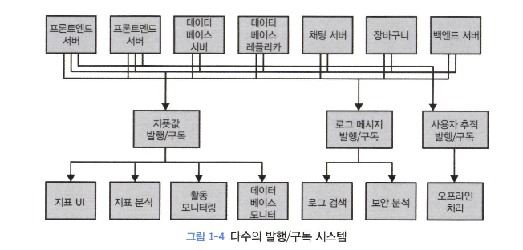
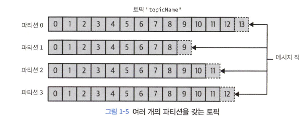

# 카프카 시작하기

- 데이터를 이동시키는 작업에 적은 노력을 들일 수록 핵심 비즈니스에 더욱 집중 가능
- data-driven-enterprise에서 `파이프라인`이 중요한 요소가 되는 이유

## Pub/Sub 메시지 전달

- 전송자는 데이터를 직접 수신자로 보내지 않는다.

- 이 아키텍처는 포인트 투 포인트 보다 바람직하지만 중복이 많고 각각의 데이터 큐 시스템을 유지 관리해야 한다.
- 중앙 집중화 필요

## 카프카 입문

- 기본 단위는 `메시지`, 메시지는 `키`라는 메타데이터가 포함되고 파티션을 결정할 때 사용
- 메시지를 `배치` 단위로 저장
- 메시지 내용의 이해를 위해 `일정한 구조`, 즉 `스키마` 부여 권장
    - XML, json을 사용하는데 호환성 유지 기능이 떨어져 `Avro` 선호
- 카프카에 저장되는 메시지는 `토픽` 단위로 분류
    - 비슷한 개념은 DB의 테이블과 파일 시스템 폴더

- 토픽은 여러 개의 `파티션` 으로 나뉘어짐
    - 커밋 로그 관점에서 하나의 로그로 해당
    - 파티션에는 메시지가 추가만 가능
    - 파티션은 복제 가능
- `스트림`은 하나의 토픽에 저장된 데이터로 간주, 컨슈머 프로듀서로의 하나의 데이터 흐름을 나타냄
- 프로듀서
    - 특정한 토픽에 메시지 발행
    - 파티셔너를 통해 파티션에 메시지 저장
- 컨슈머
    - 1개 이상의 토픽을 구독
    - 파티션에 메시지를 쓰여진 순서대로 읽어 옴
    - `오프셋` 기록, 어디까지 읽었는지 유지
    - 컨슈머 그룹의 일원으로 작동
        - 컨슈머 그룹은 하나 이상의 컨슈머로 이루어짐
        - 각 파티션이 하나의 컨슈머에 의해서만 읽히도록 한다
        - 4장에서 자세히
- 카프카 서버를 `브로커` 라고 한다.
- 카프카 브로커는 `클러스터`의 일부로 작동한다.
    - 여러 개의 브로커 중 하나가 `컨트롤러` 역할을 한다.
    - 파티션은 클러스터 안의 브로커 중 하나가 담당하고 그 브로커를 `파티션 리더`라고 부름
    - 복제된 파티션은 `팔로워`
- 카프카의 핵심 기능 중 하나는 메시지를 `보존` 하는 것

## 왜 카프카인가?

- 다중 프로듀서, 다중 컨슈머
    - 다른 큐과 다르게 **컨슈머 그룹**의 여러 컨슈머가 메시지를 소비한다.
- 디스크 기반이기 때문에 메시지가 유실되지 않는다.
- 유연한 확장성
- 다양한 API와 라이브러리가 있다.
    - 카프카 커넥트, 스트림즈

## 이용사례

- 활동 추적 (원래 링크드인 목적)
- 메시지 교환
- 지표 및 로그 수집
- 커밋 로그
- 스트림 처리