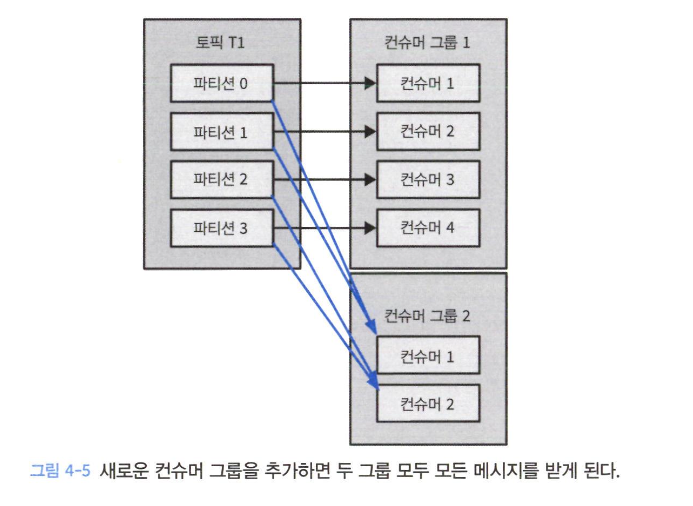

# 카프카 컨슈머

## 컨슈머와 컨슈머 그룹

- 컨슈머 하나는 프로듀서가 발행하는 메시지의 양이 많이질 수록 버티지 못한다.
- 그래서 컨슈머 그룹을 만들어 하나의 토픽을 구독하고 여러 파티션에서 메시지를 읽는다. -> 수평 확장 가능
- 파티션 수 이상 컨슈머를 투입하는 것은 아무 의미 없다.
- 이 외에도 다른 용도를 가진 컨슈머 그룹이 이미 메시지를 받고 있는 컨슈머 그룹이 있어도 메시지를 받을 수 있다.

### 컨슈머 그룹과 파티션 리밸런스

- 컨슈머에 할당된 파티션을 다른 컨슈머에 할당해주는 작업을 `리밸런스` 라고 한다.
    - 조급한 리밸런스
        - 리밸런스가 실행되는 와중에 모든 컨슈머는 읽기 작업을 중단하고 자신에게 할당된 모든 파티션을 소유권 포기
        - 그리고 컨슈머 그룹에 다시 참여하여 새로운 파티션 할당
    - 협리적 리밸런스
        - 한 컨슈머에게 할당되어 있던 파티션만 다른 컨슈머에 재할당
    - 리밸런스는 컨슈머 그룹의 그룹 코디네이터 역할을 지정받은 브로커에게 하트비트를 전송하는데, 전송하지 않으면 세션 타임아웃이 발생하면서 일어난다.
    - 3.1 부터는 협리적 리밸런스가 default

### 정적 그룹 멤버쉽

- 컨슈머 그룹의 한 컨슈머에게 `group.instance.id` 값을 잡아주면, 꺼지더라도 그룹에서 나가지지 않는다. (코디네이터가 캐싱해둠)
- `group.instance.id`는 고유해야함
- 로컬 상태나 캐시를 유지해야할 때 편리
- 근데 꺼졌을 때 다른 컨슈머가 꺼진 컨슈머가 할당하고 있던 파티션을 재할당하지 않기에, 다시 켜졌을 때 메시지 읽는 속도를 따라올 수 있는지 확인해야함

## 카프카 컨슈머 생성하기

- 프로듀서와 비슷하나 컨슈머가 속하는 컨슈머 그룹의 이름을 지정하는 `group.id`를 추가한다.

## 토픽 구독하기

- `subscribe()` 메서드를 통해 토픽 목록을 매개변수로 받는다.
- 정규식을 통해서 토픽을 구독하면, 해당 정규식에 맞는 토픽이 생성될 때 컨슈머는 리밸런싱되어서 토픽의 메시지를 받는다.

## 폴링 루프

- 무한 루프로 카프카의 데이터를 폴링한다.
- `consumer.poll(timeout)`의 timeout 매개변수는 컨슈머 버퍼에 데이터가 없을 경우 poll()이 블록될 수 있는 최대 시간 결정
- **하나의 스레드에 하나의 컨슈머는 원칙이다.**

## 오프셋과 커밋

- 파티션에서의 현재 위치를 업데이트하는 작업을 오프셋과 커밋이라고 부른다.
- 마지막 메시지를 커밋해서 앞의 메시지들은 암묵적으로 성공처리됨

### 자동 커밋

- 컨슈머가 대신하도록 하는 것.
- `enable.auto.commit`을 true하면 5초에 한번 마지막 오프셋을 커밋
- 5초의 간격이 있기에, 3초에 크래시되면 리밸런싱 이후 메시지들이 중복 처리됨
- `poll()`과 `close()`는 호출시 이전 호출에서 리턴된 마지막 오프셋을 커밋한다.

### 현재 오프셋 커밋하기

- `enable.auto.commit=false` 와 `commitSync()`를 사용
- `commitSync()`는 `poll()`에 의해 리턴된 마지막 오프셋을 커밋

### 비동기적 커밋

- 수동 커밋은 커밋할 때 블록된다는 것. 그래서 비동기적 커밋을 사용할 수도 있음
- 하지만 재시도를 하지 않는다.
- 콜백함수도 지정해줄 수 있다. 콜백함수에 번호를 1씩 증가시킨뒤 재시도 요청이 있을 때 현재 번호와 주어진 번호를 비교해서 재시도 가능

### 동기적 커밋과 비동기적 커밋 동시에 사용

- 일시적인 문제일 경우 뒤이은 커밋이 성공하기 때문에 상관 없음
- 근데 close 혹은 리밸런스 전 마지막 커밋이면 `comitSync()`를 통해서 성공여부를 추가로 확인해준다.

### 특정 오프셋 커밋하기

- `commitSync()`나 `commitAsync()`는 커밋하고자 하는 파티션과 오프셋의 맵을 줄 수 있다.