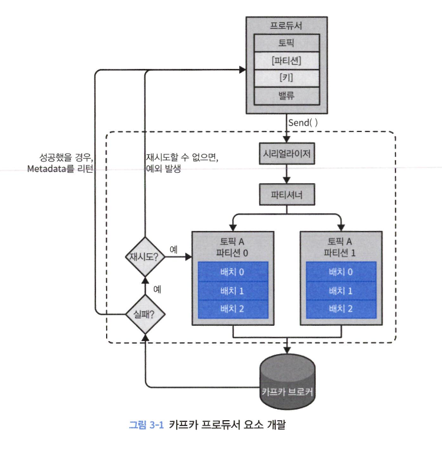
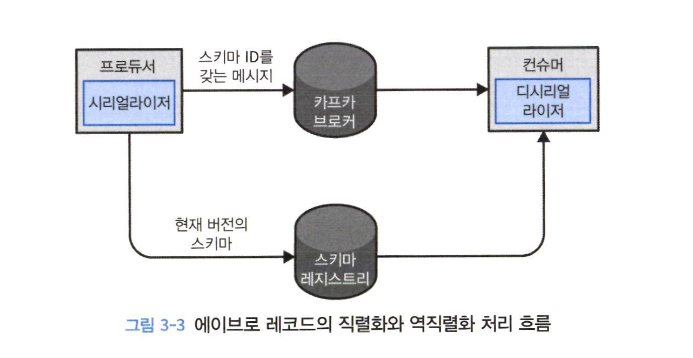

# 카프카 프로듀서

- 다양한 요구사항이 존재
    - 신용카드 트랜잭션 처리 시스템: 메시지의 어떠한 유실, 중복 허용 X, 처리율은 높아야함
    - 웹사이트 클릭 정보: 어느정도 중복, 유실 괜찮고, 지연율도 늦어져도 괜찮다.



- 키와 객체를 직렬화햇거 바이트 배열로 변환
- 데이터를 파티션을 결정하는 파티셔너에게 전달
- 같은 토픽 파티션으로 전ㄴ송될 레코드들을 모은 레코드 배치에 추가 -> 전송

## 프로듀서 생성

- bootstrap.server
    - 브로커의 host:post 목록
    - 최소 2개 이상의 브로커에 지정하도록 권장
- key.serializer
    - 카프카에 쓸 레코드의 키의 값을 직렬화하기 위해 사용하는 시리얼라이저 지정
- value.serialzier
    - 벨류 값을 직렬화 하기 위해 사용하는 시리얼라이저 지정
- 메시지 전송 방법
    - 파이어 앤 포켓: 메시지를 서버에 전송만하고 성공 혹은 실패 여부 신경 X 
    - 동기적 전송
    - 비동기적 전송

## 카프카로 메시지 전달하기
- 동기적 전송
    - 성능이 낮아져서 잘 사용되지는 않는다.
    - 메시지 크기가 너무 클 경우와 같은 에러일 때는 재시도를 하지 않고, 파티션이 리더가 아니거나 연결 에러 등은 재시도가 가능하다.
- 비동기적 전송
    - 메시지 전송이 완전히 실패했을 때는 callback 함수가 필요하고, send에 같이 보낸다

    ```java
    producer.send(record, new DemoProducerCallback());
    ```

## 프로듀서 설정하기

- client.id: 프로듀서 식별값, 트러뷸 슈팅에 장점
- acks
    - `acks = 0`: 성공적으로 전달되었다고 간주, 응답을 기다리지 않는다.
    - `acks = 1`: 리더 레플리카가 메시지를 받는 순간 브로커로부터 성공했다는 응답을 받는다.
    - `acks=all`: 3.0 기본 값, 모든 인-싱크 레플리카에 전달된 뒤에야 성공
    - 이 세가지의  **종단 지연**은 모두 똑같다. 일관성 유지를 위해 모든 인-싱크 레플리카에 복제가 완료되어야 컨슈머가 소비 가능하기 때문
- linger.ms: 배치를 전송하기 전까지 대기하는 시간, 0보다 큰 값으로 설정하면 처리율을 크게 늘릴 수 있다.
- buffer.memory: 전송하기 전 메시지를 대기시키는 버퍼의 크기 결정
- compression type: 압축 한 뒤 브로커에 보냄 **Snappy 추천**
- batch.size: 배치에 사용될 메모리 양을 결정, 크게 해도 가득 찰 때 까지 기다리진 않아서 큰게 작은 것 보다 좋다
- max.request.size: 프로듀서가 전송하는 쓰기 요청의 크기 결정
- enable.idempotence: `정확히 한번`

## 시리얼라이저

- 라이브러리를 사용하지 않으면, int -> Long으로 변환할 때 모든 팀이 시리얼라이저 코드를 수정해야하는 사단이 발생
- Avro를 사용하여 직렬화
    - 데이터를 읽는 쪽 애플리케이션을 전부 변경하지 않고 스키마를 변경해도 어떠한 예외나 에러 발생 X

    


    - 스키마 레지스트리를 사용하여 고유 식별자를 심어주면 컨슈머는 역직렬화할 때 레지스트리에서 스키마를 가져온다.

## 파티션

- 키값은 토픽의 여러 파티션 중 해당 메시지가 저장될 파티션을 정하는 기준점
- 같은 키값은 모두 파티션에 저장
    - 근데 파티션을 추가하면 이것이 깨진다. 그래서 처음부터 충분한 파티션 수를 고려
- 키값이 없으면 라운드 로빈으로 파티션에 저장
- 기본 파티셔너 말고도 종류가 많다. UniformStickyPartitioner를 사용할 경우 균등한 분포
- 커스텀 파티셔너를 통해서 특정 키값만 한 파티션에 몰고, 다른 키값은 해당 파티션에 들어오지 않게 해줄 수 있다.

## 헤더

- 카프카 레코드의 키/밸류값을 건드리지 않고 추가 메타데이터를 심을 때 사용

## 인터셉터

- 코드를 고치지 않고 작동을 변경해야 할 때 사용
- `onSend`는 프로듀서가 브로커에게 보내기 전, `onAcknowledgement`는 컨슈머가 받았을 때 호출
- 인터셉터를 만들고 CLASSPATH로 jar 경로를 등록한 뒤, 애플리케이션을 실행시킬 때 설정파일을 포함해서 실행시킨다.

## 쿼터, 스로틀링

- 쓰기 쿼터
- 읽기 쿼터
- 요청 쿼터

- 쓰기 읽기 속도를 제한할 수 있다.
- JMX 메트릭을 통해서 스로틀링 작동 여부를 알 수 있다.
- 설정 변경하면 브로커를 재시작, 그래서 kafka-configs.sh나 AdminClient API로 동적 설정 기능을 사용
- 프로듀서와 컨슈머의 속도를 맞춰야 TimeoutException 등을 방지할 수 있음.
    - 프로듀서가 너무 많은 메시지를 보내면 컨슈머는 메모리의 큐에 적재하고 넘치면 블록
    - 버퍼의 공간이 확보되지 않으면 TimeoutException을 내고, 배치에 올라간 레코드는 시간이 지나면서 무효화

