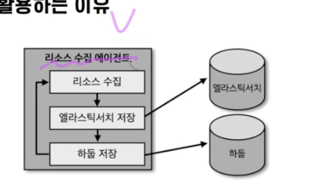
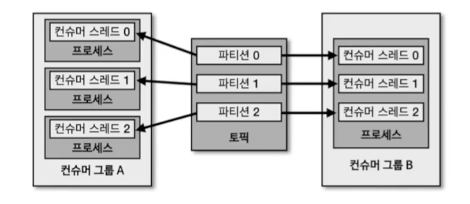

# 5주차


## 컨슈머

- 토픽을 사용한다. 즉, 데이터를 처리한다.


- Fetcher: 리더 파티션으로부터 레코드들을 미리 가져온다.
- poll: completedFetches가 충분히 모이면 Fetcher에 있는 레코드를 리턴한다.
- ConsumerRecords: 처리하고자하는 레코드들의 모음이다. 오프셋이 있다.(커밋을 해야한다)

## 컨슈머 그룹


- 가장 중요한 부분 중 하나
- 목적에 따라 데이터를 처리하는 컨슈머를 묶은 것이 컨슈머 그룹이다.
- 특정 컨슈머 그룹이 파티션들의 레코드를 가져간다고 없어지지 않는다. 즉, 새로운 컨슈머 그룹이 생겨도 그대로 레코드들을 사용할 수 있다.
- subscribe 메소드로 토픽을 구독하면 토픽의 파티션의 레코드들을 다 가져간다.
- 파티션 개수만큼 컨슈머를 늘려서 하는 것이 좋다. (최대의 성능)

### 컨슈머 그룹의 컨슈머가 파티션 개수보다 많을 경우?
- 파티션은 최대 하나의 컨슈머만 할당 가능
- 남는 컨슈머는 유휴 상태가 된다. 파티션 개수만큼만 컨슈머를 띄우자
### 컨슈머 그룹을 활용하는 이유

- 이런 동기적인 프로세스일 때, 엘라스틱서치가 뻗었을 때 문제가 발생한다.

- 이러한 커플링을 끊기 위해서는 프로듀서로 보내고 파티션으로 나눈다.
- 그룹 별로 컨슈머 개수도 유연하게 가져갈 수 있다.
- 여기서 다른 DB에 저장하고 싶으면 하나의 컨슈머 그룹을 더 만들면 된다.

## 리밸런싱

- 파티션 - 컨슈머의 할당이 달라지는 것
- 컨슈머 추가될 때는 파티션을 매칭해준다.
- 리밸런싱에 대응하는 코드를 작성해야 한다.

## 커밋

- 리더 파티션의 레코드를 `poll()`을 해서 컨슈머 그룹이 가져가면 `commit()` 을 한다.
- 특정 레코드를 처리하면 `commit()`을 안전하게 해야한다. 그래야 다음 레코도 사용 가능

## Assignor
- 컨슈머와 파티션의 할당 정책, 기본은 `RangeAssignor`
- RangeAssignor: 파티션을 숫자로 정렬하고, 컨슈머를 사전 순서로 정렬
- RoundRobinAssignor: 번갈아 가면서 할당
- StickyAssignor: 최대한 파티션을 균등하게 배분하면서 할당

## 컨슈머 주요 옵션
### 필수 옵션(기본 값이 없다)
- bootstrap.servers: 브로커의 호스트, 이름, 포트
- key.deserializer: 키를 역직렬화
- value.deserializer: 값을 역직렬화

### 선택옵션

- 자동 커밋 True로하고 interval을 줄이는 것도 좋은 방법이다.

## auto.offset.reset
- 어느 오프셋부터 읽을지?
- 컨슈머가 오프셋이 없을 때 적용되는 옵션. 즉 컨슈머가 새로 생겼을 때(커밋을 하지 않았을 때)의 옵션
- latest: 가장 높은(최근) 오프셋부터 읽기 시작
- earliset: 가장 낮은(가장 오래 된) 오프셋 부터 읽기 시작
- none: `컨슈머 그룹`이 커밋한 기록이 있는지 찾아봄. 없으면 오류, 있으면 기존 커밋 기록 이후 오프셋 부터. 기본은 `latest`이다.

## 동기 오프셋 커밋 컨슈머
- `poll()` 이후에 `commitSync()`를 호출하면 오프셋 커밋을 명시적으로 가능
### 레코드 단위 컨슈머

- 커밋은 컨슈머 - 프로듀서 간의 통신이기 때문에 너무 많이 커밋이 일어나면 좋지 않다. 일반적인 환경에서는 많이 사용되지 않는다.
## 비동기 오프셋 커밋 컨슈머
- 동기 오프셋 커밋은 응답을 기다리는 동안 데이터 처리가 일시적으로 중단.
- `commitAsync()` 을 사용해서 사용
### 비동기 오프셋 커밋 롤백

- 비동기 처리할 때는 이렇게 로깅을 하는 것이 좋다.

## 리배런스 리스너를 가진 컨슈머
- 리밸런스 발생 감지를 위해 `ConsumerRebalanceListener`인터페이스 지원
- `consumer.subscribe()`의 두번째 인자에 리밸런서를 넣어줘야함.
- 넣음으로써 컨슈머가 생기거나 없어질 때 리밸런싱을 할 수 있음
- onPartitionAssgined(): 리밸런스가 끝난 뒤에 파티션이 할당 완료되면 호출되는 메서드 
- onPartitionRevoked(): 시작되기 전에 호출되는 메서드. 마지막으로 처리한 레코드를 기준으로 커밋을 위해서는 이 메서드 안에 커밋을 구현하여 처리

## 파티션 할당 컨슈머
- 직접 토픽에 대해서 파티션을 각각 할당할 때 `assign()` 을 사용한다.
- 특별하게 파티션의 메시지를 할당할 때 사용. 자주 쓰이지는 않는다.

## 컨슈머의 안전한 종료
- 반드시 안전하게 종료되어야 한다.
- 하지 않으면 세션 타임아웃이 될 때 까지 좀비처럼 남게된다. -> 리밸런싱 늦어짐
- `wakeup()` 메서드를 사용해서 종료, 이후에 poll()하면 WakeupException 발생
- try catch를 통해서 WakeupException을 감지하고, finally에서 `consumer.close()`를 호출한다.
- 런타임에 셧다운스레드를 추가 `Runtime.getRuntime().addShutdownHook(new ShutdownThread());` 자바 어플리케이션에 명시적으로 셧다운 훅을 날릴 수 있다.
```java
static class ShutdownThread extends Thread {
        public void run() {
            logger.info("Shutdown hook");
            consumer.wakeup();
        }
    }
```
- 여기서 프로세스를 종료시키면 이렇게 Wakeup 로그가 뜨게 된다.

- 참고로 종료해야할 다른 리소스가 존재한다면 같이 finally에서 같이 종료해줘라.

## 멀티스레드 컨슈머

- 컨슈머는 1 thread에 1 consumer이다.
- 멀티프로세스 vs 멀티스레드

## 컨슈머 랙
- 프로듀서는 최근의 오프셋이 레코드를 넣지만, 컨슈머는 늦어질 수 있다.
- 파티션의 최신 오프셋과 컨슈머 오프셋간 차이가 컨슈머 랙이다.
- 랙이 커지면 지연이 발생하고 있다는 것이다. 정상 동작하는지 여부를 확인 가능
- 컨슈머 랙은 그룹과 토픽, 파티션 별로 생성된다.
    - 한 토픽에 파티션이 세개있고, 컨슈머 그룹이 두개면 6개의 컨슈머 랙이 있다.
- 컨슈머 랙을 모니터링 하는 것은 카프카를 통한 데이터 파이프라인을 운영하는데 핵심
    - 파티션 개수 등등을 정하는데 참고
    - 지연을 줄이려면 파티션 늘리고, 컨슈머 늘리고

## 컨슈머 랙을 확인하는 방법 3가지
### 카프카 명령어 사용
- kafka-consumer-groups.sh 명령어
- `bin/kafka-consumer-groups.sh --bootstrap-server my-kafka: 9092 --group my-group --describe`
- 테스트용 카프카에서 주로 사용
### metrics() 메서드 사용

- 문제점은 컨슈머가 정상 동작할 경우에만 확인할 수 있다.
- 모든 컨슈머 애플리케이션에 컨슈머 랙 모니터링 코드를 중복 작성
- 카프카 서드 파티 애플리케이션의 컨슈머 랙 모니터링이 불가능하다.
- 한계점이 많다.
### 외부 모니터링 툴 사용
- 데이터독, 컨플루언트 컨트롤 센터
- 오픈 소스 `버로우` 라는 것도 있다.
    - 모든 토픽과 모든 컨슈머 그룹을 수집하고 보여준다.
## 버로우
- 링크드인에서 만든 컨슈머 랙 체크 툴
- rest api를 통해 컨슈머 그룹 별로 컨슈머 랙을 확인

- 랙의 임계치를 받는 것은 사실상 무의미하다. 일시적으로 프로듀서가 데이터를 많이 보내면 일시적으로 임계치가 넘어가기 때문
- 컨슈머 랙 평가를 Evalution으로 표현
    - 슬라이딩 윈도우 계산을 통해 알아냄
    - OK, STALLED, STOPPED / OK, WARNING, ERROR로 파티션, 컨슈머표현

