# 카프카 스트림즈
- 자바 기반 카프카 공식 라이브러리
## 왜 프로듀서 컨슈머와 조합하지 않는가?
- 스트림 데이터 처리에 있는 다양한 기능을 스트림즈 DSL로 제공한다.
- 추상화된 레이어, 코드로 사용하는 것에 장점
- 유사하게 만들어도 단 하나의 데이터 처리 및 장애 허용 시스템을 구현하기 어려움
- 사용 토픽과 저장 토픽의 카프카 클러스터가 다를 때, 스트림즈는 지원하지 않는다. 즉 같은 클러스터에서만 가능
## 내부구조
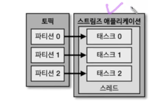
- 스레드에 테스크가 여러 개, 파티션과 1대 1
- 스레드를 늘리는 방법, 아니면 동일한 애플리케이션으로 병렬처리
- 스트림즈는 `application id`로 컨슈머 그룹이랑 비슷함. 프로세스 늘리면 애플리케이션 아이디를 같게 하면 됨
## 토폴리지
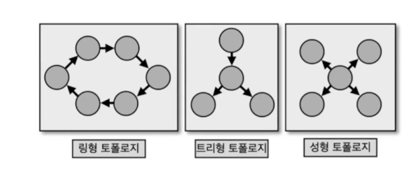
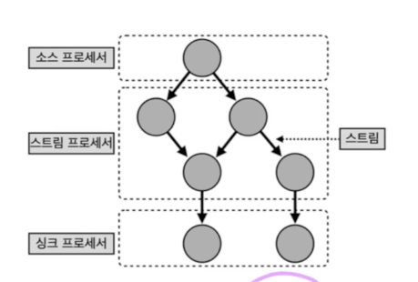
- 카프카 스트림즈는 트리형 토폴리지임
## 프로세서 종류
- 소스 프로세서는 토픽에서 데이터를 가져옴
- 스트림 프로세서는 데이터를 처리, 변환, 분기 처리
- 싱크 프로세서는 어딘가에 저장하는 역할(다른 토픽에 저장)
## 스트림즈 DSL과 프로세서 API
- 스트림즈 DSL는 프로세싱에 쓰일 만한 다양한 기능을 자체 API로 만들어 둠
- 일부 API는 일부 기능들의 경우는 프로세서 API를 사용
## 스트림즈 DSL
- KStream, KTable, GlobalKTabke이 있다.
## Kstream
- 레코드의 흐름을 표현한 것, 메시지 키와 메시지 값으로 구성
## KTable
- 메시지 키를 기준으로 묶어서 가장 키의 가장 최근의 값만 보여준다.
## 코파티셔닝
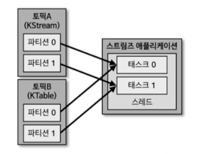
- Kstream과 KTable을 조인하려면 반드시 코파티셔닝이 되어있어야함
- 2개의 파티션 개수가 동일하고 파티셔닝 전략을 동일하게 맞추는 작업
- 파티션 개수가 맞지 않으면 토폴로지 예외 발생 -> GlobalKTable 사용
## GlobalKTable
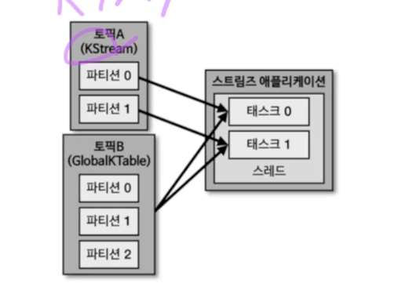
- 전체 파티션의 모든 데이터를 각각의 테스크가 처리를 한다.
- 다 이것으로 하지 않는 이유는, GlobalKTable 데이터가 크다면 스트림즈 애플리케이션에 무리가 간다.
## 스트림즈DSL 주요 옵션
### 필수 옵션
- bootstrap.servers
- application.id
### 선택 옵션
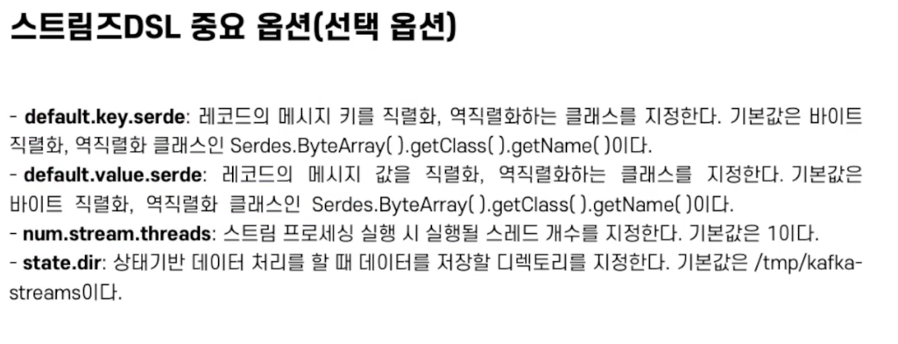
- 스케일 업 할 때 num.stream.threads를 지정하라

## KTable과 KSteram을 join()
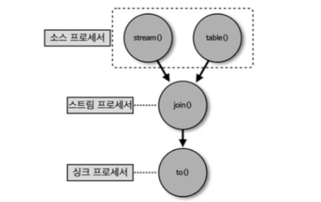
- 주문과 주소를 조인, 주문을 stream에, 주소를 table에 조인
- 파티션의 개수만큼 병렬처리 가능
- KTable을 키밸류 저장소로 활용할 수 있다.

## GlobalKTable과 KSteram을 join()
- 데이터가 그리 많지 않으면 코파티셔닝이 되어있지 않은 토픽을 조인해야할 때는 KTable을 GlobalKTable로 선언하는 것이 더 좋다.
- 아니면 리파티셔닝을을 수행한다.

## 스트림즈DSL - window processing
- 특정 시간에 대응하여 취합 연산을 처리할 때 활용
- 메시지 키 기준으로 취합, 동일한 파티션에는 동일한 메시지키가 있는 레코드가 존재해야지만 정확한 취합이 가능하다.
### 텀블링 윈도우
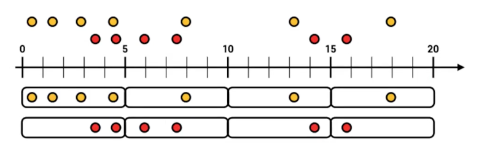
- 서로 겹치지 않은 윈도우를 특정 간격으로 지속적으로 처리
- 매 5분간 접속한 고객의 수를 측정 등등
- `groupByKey`와 `windowedBy`를 사용
    - `windowedBy`는 텀플링 윈도우의 사이즈
- 주의점
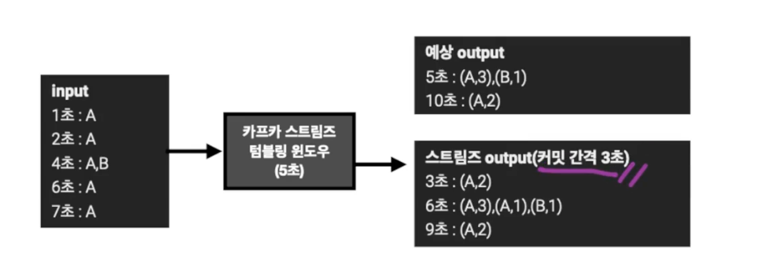
    - 커밋을 수행할 때, 윈도우 사이즈가 종료되지 않아도 중간 정산 데이터를 출력
    - windowed를 기준으로 동일 윈도우 시간 데이터는 겹쳐쓰기 하는 방식으로 처리하는 것이 좋다.
    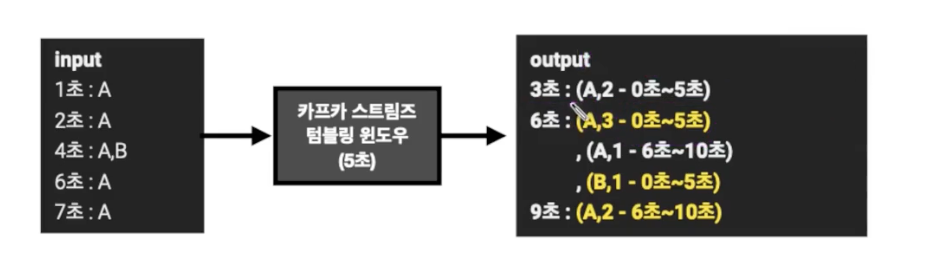
    - 6초, 9초의 데이터만 남기면 된다.

### 호핑 윈도우
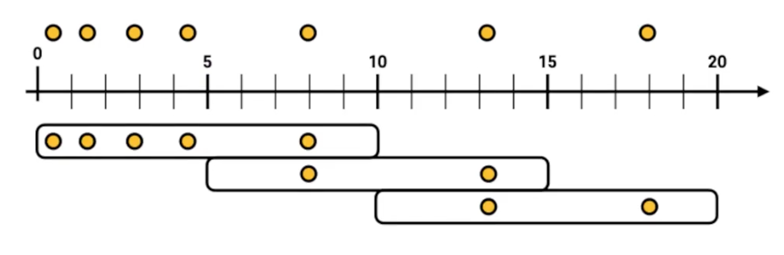
- 일정 시간 간격으로 윈도우가 존재하는 윈도우 연산

### 슬라이딩 윈도우
- 호핑 윈도우와 유사하지만 데이터의 정확한 시간을 바탕으로 윈도우 사이즈에 포함되는 데이터를 모두 연산에 포함

### 세션 윈도우
- 세션의 최대 만료 시간에 따라 윈도우 사이즈가 달라짐

## Queryable store
- KTable은 카프카 토픽의 데이터를 rocksDB에 뷰로 만들어 사용
- 키, 값을 기반으로 키밸류스토어로 사용 가능
- ReadOnlyKeyValueStore로 뷰를 가져오면 토픽 데이터를 조회 가능

## 프로세서 API
- DSL은 추상화, 그 내부가 프로세서 API이다.