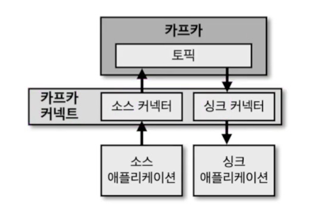

# 카프카 커넥트

- 데이터 파이르라인의 반복 작업을 줄이고, 효율적인 전송을 이루기 위한 애플리케이션
- 소스 커넥터로 넣고(프로듀스), 싱크 DB로 넣는 역할(컨슘)을 싱크 커넥터
- 커넥터 안에 태스크가 있다. 이 둘을 코드를 짜야함
- 8083 포트로 restapi를 호출할 수 있다.

## 소스 커넥터, 싱크 커넥터
- 소스 커넥터: 프로듀서 역할
- 싱크 커넥터: 컨슈머 역할

## 커넥터 플러그인
- 커넥터는 오픈소스 커넥터나 직접 개발 커넥터를 추가시킬 수 있다.
- 오픈소스 커넥터
    - 이미 제공되고 있는 커넥터를 인터넷에서 다운 받음
    - S3 커넥터, JDBC, 엘라스틱서치 커넥터 등등 이미 공개
- 직접 개발 커넥터
    - jar을 만들어서 실행시키고 커넥터에 추가시킴

## 컨머터, 트랜스폼
- 데이터 처리 전 스키마를 변경, 메시지 단위로 변환하기 위해서 옵션적으로 사용함

## 커넥트를 실행하는 방법
### 단일 모드 커넥트

- 1개의 프로세스만 실행되는 점
- 고가용성 구성 X, 개발환경이나 중요도 낮은 파이프라인
### 분산 모드 커넥트

- 2대 이상의 서버에서 클러스터 형태로 운영
- 분산 모드로 하는 것이 제일 좋다
