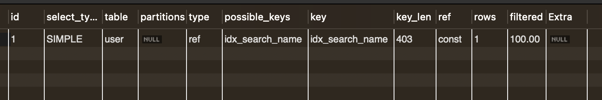

# Generated Columns

- generated columns는 Mysql 5.7 버전부터 지원한다.
- 데이터가 삽입이 될 때나 업데이트 시에 특정 컬럼의 값을 자동으로 계산하여 저장시켜준다.
- 또한 인덱스도 생성할 수 있다.

## 유형
- 가상 컬럼(VIRTUAL): 계산된 값이 테이블에 저장되지 않고 쿼리 시점에 실시간으로 계산
- 저장된 컬럼(STORED): 계산된 값이 테이블에 실제로 저장되며, 데이터 삽입 또는 업데이트 시 자동으로 갱신

## 예시

```sql
CREATE TABLE user (
    id INT AUTO_INCREMENT PRIMARY KEY,
    name VARCHAR(100),
    birth_date DATE,
    is_adult BOOLEAN AS (TIMESTAMPDIFF(YEAR, birth_date, CURDATE()) >= 18) STORED
);
```

- 이런 예시가 있다고 생각하자. `STORED`를 사용하면 생성된 컬럼이 실제로 테이블에 저장되며 인덱스를 생성할 수 있다.
- 예시에서의 `is_adult`는 `birth_date`를 기반으로 사용자가 성인인지 여부를 계산하여 저장한다.
- 만약 18이상이면 `is_adult` 컬럼에는 1이 저장되고 아니면 0이 저장된다.

```sql
INSERT INTO user (name, birth_date) VALUES
('Alice', '2000-01-15'),
('Bob', '2010-05-20'),
('Charlie', '1995-08-30');
```

- 이 데이터 삽입시 다음과 같은 결과를 볼 수 있다.

```sql
SELECT * FROM user;

+----+---------+------------+----------+
| id | name    | birth_date | is_adult |
+----+---------+------------+----------+
|  1 | Alice   | 2000-01-15 |        1 |
|  2 | Bob     | 2010-05-20 |        0 |
|  3 | Charlie | 1995-08-30 |        1 |
+----+---------+------------+----------+
```

## 어느 때 사용하는 것이 좋느냐?

- 본래 이 generated column을 사용하려고 했던 목적은 다음과 같은 상황에서 검색 성능을 더 높이려고 했다.
    - 회원의 `original_name`과 현재 바뀐 `name` 컬럼이 존재한다.
    - 회원을 찾을 때 `original_name`이 존재하지 않으면 `name`으로 검색한다.
- 이러면 다음과 같은 쿼리를 짤 수 있다.

```sql
SELECT
    *
FROM
    users
WHERE
    COALESCE(original_name, name) = "이현제"
```

- 이럴 경우에 original_name과 name에 인덱스를 생성했을 경우, 옵티마이저는 full table scan을 하게된다.
- 하지만 generated columns로 검색용으로 생성한 컬럼으로 조건절을 검색할 경우 다음과 같은 결과를 얻을 수 있다.

```sql
EXPLAIN SELECT
    *
    FROM
        user
    WHERE
        search_name = "Alice"
```



- 인덱스 reference를 사용해서 아주 빠르고 효율적으로 찾을 수 있다.
- 하지만 단점 또한 존재하는데 우선 당연하게도 칼럼 하나를 물리적으로 저장하기 때문에 크기가 커진다.
- 또한 수정 및 저장시 오버헤드가 발생한다. 값이 삽입되거나 삭제될 때 연산을 해야하기 때문이다.
- 또한 백업 및 복원시 시간이 더 오래 걸리고, 정합성 문제도 생길 수 있다.
- 따라서 만약 `search_name`과 같은 generated column을 자주 조회하는 API call이 빈번하다면 도입을 고려할 만 하다.
- 하지만 API call이 드물게 일어나고, 데이터 삽입이 빈번하거나, 연산의 대상이 되는 컬럼이 자주 변경된다면 도입을 신중하게 하는 것이 좋다. 