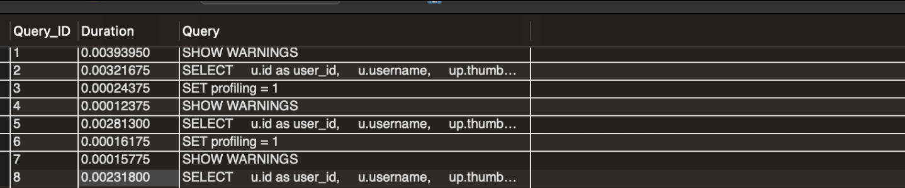

# 간단한 쿼리 시간 측정 방법
## 쿼리문
```SQL
SET profiling = 1;

SELECT
FROM
WHERE

SHOW PROFILES
```
- `SET profiling = 1;` 명령어를 실행하면 MySQL 세션에서 프로파일링이 활성화, 이는 해당 세션에서 실행되는 모든 쿼리에 대한 성능 데이터를 수집할 수 있음
- 쿼리가 실행될 때 MySQL은 해당 쿼리의 실행 시간, CPU 사용량, 디스크 I/O 등과 같은 성능 데이터를 수집
- `SHOW PROFILES;` 명령어를 실행하면 현재 세션에서 실행된 쿼리 리스트와 각 쿼리의 총 실행 시간이 표시
## 예시 결과
