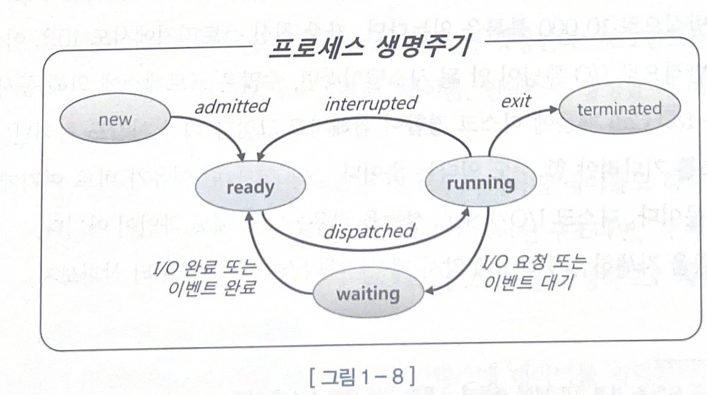
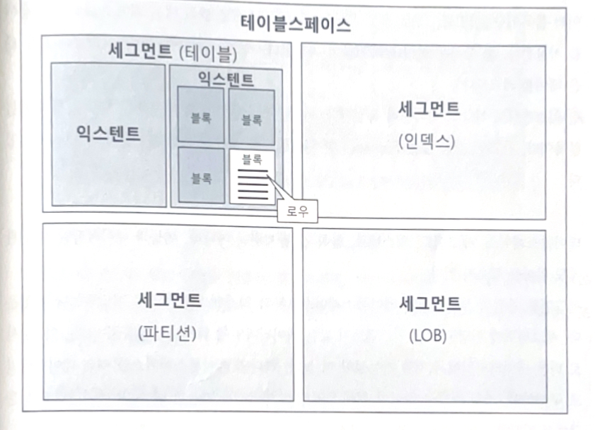

# 데이터 저장 구조 및 I/O 메커니즘

## SQL 느린 이유

- 대부분 디스크 I/O 이다. 프로세스는 생성 종료 전까지 준비/실행/대기를 반복한다.
- interrupt에 의해 수시로 실행 준비 상태로 전환 -> 그리고 다시 실행 상태로 변한다.
- 프로세스는 디스크에서 데이터를 읽어야할 때 CPU를 OS에 반환하고 waiting 상태에서 I/O가 완료되기를 기다린다.
- 따라서 SQL이 느린 이유는 디스크 I/O이다. 이것이 SQL의 성능을 좌우한다.

## 데이터베이스 저장 구조

- 데이터를 담으려면 `테이블 스페이스` 생성
    - 세그턴트를 담는 컨테이너
    - 여러 개의 데이터파일로 구성
    - 세그먼트는 데이터 저장공간이 필요한 오브젝트, 익스텐트의 집합, 익스텐트는 공간을 확장하는 단위
    - 익스텐트 안에는 여러 데이터 블록이 있고, 여기에서 실제로 레코드를 저장
- 세그먼트가 부족하면 익스텐트를 추가 할당 받으나, 모든 익스텐스는 같은 데이터 파일에 위치하지 않을 수 있음
- 파일 경합을 위해 DBMS가 여러 데이터 파일로 분산 저장

## 블록 단위 IO

- 블록이 DBMS를 읽고 쓰는 단위
- 따라서 1Byte를 읽기 위해 8KB 크기의 블록을 읽어야함. (오라클은 2, 4 KB 블록도 지원하긴 함)
- 인덱스도 마찬가지로 블록 단위

## 시퀀셜 액세스 vs 랜덤 엑세스

- 시퀀셜 엑세스: 논리적, 물리적 연결된 순서에 따라 차례대로 블록 읽기
    - 세그먼트 헤더에 익스텐트 맵을 가지고 있어, 여기의 첫 번째 블록 주소 값을 참조
- 랜덤 엑세스: 레코드 하나를 읽기 위해 한 블록씩 접근 하는 방식

## 논리적 IO vs 물리적 IO

- 라이브러리 캐시만큼 `DB 버퍼캐시` 도 중요
- 버퍼캐시는 데이터 캐시, 공유 메모리임으로 다른 프로세스도 이득
- 논리적 I/O: SQL을 처리하는 과정에 **발생한 총 블록 I/O**, 즉 메모리 I/O(일단 DB 버퍼 캐시를 경유하기 때문)
- 물리적 I/O: 디스크에서 발생한 I/O, 캐시에서 못 찾고 디스크 엑세스할 때
    - 포인트는 디스크에 접근해서 꺼내온 뒤, 캐시에 적재하고 그것을 읽는다.

## 버퍼 캐시 히트율

- BHCR(버퍼 캐시 히트율)을 보면 결론은 논리적 I/O를 줄여야 한다.
- 이유는 물리적 I/O는 통제 불가능한 외생 변수이고, 물리적 I/O는 논리적 I/O는 BHCR에 의해 결정된다.
- 논리적 I/O는 SQL을 튜닝하면 된다. 즉 SQL 튜닝은 **논리적 I/O를 줄여서 물리적 I/O를 줄이는 것** 이다.

## Single Block I/O vs Multiblock I/O

- Single Block I/O: 한 번에 한 블록씩 요청
    - ex) 인덱스 처럼 소량의 데이터를 읽을 때
- Multiblock I/O: 한 번에 여러 블록씩 요청
    - 테이블 전체 스캔할 때
    - 테이블이 클 수록 좋음, I/O를 줄이기 위해서
    - 캐시에서 찾지 못한 블록을 읽으려고 I/O call을 할 때 인접한 블록을 한꺼번에 읽어 캐시에 적재
    - 여기서 인접한 블록이란 같은 익스텐트에 속한 블록

## Table Full Scan vs Index Range Scan

- 온라인 트랜잭션과 달리 집계용 SQL이나 배치 프로그램은 Table Full Scan으로 유도하면 성능이 좋아진다.
- Table Full Scan은 시퀀셜 엑세스와 Multiple I/O 방식으로 찾는다.
    - 스토리지 스캔 능력이 좋아지면 성능도 좋아짐
    - 많은 데이터를 찾을 때 이득이나, 적은 데이터를 찾을 때는 손해, 이때 인덱스를 사용
- 만약 많은 양의 데이터를 찾을 때 Index range scan을 사용하면?
    - 캐시에서 블록을 못 찾으면 하나의 레코드를 읽기 위해 계속 I/O
    - 같은 블록을 계속 반복해서 읽는 비효율

## 캐시 탐색 알고리즘

- 버퍼 캐시에서 블록을 찾을 때 해시 알고리즘으로 버퍼를 찾고, 거기서 얻은 포인터로 버퍼 블록을 액세스
- 해시 체인 내에서는 정렬이 보장되지 않는다.

## 메모리 공유자원에 대한 엑세스 직렬화

- SGA는 공유 메모리이기 때문에 두 개 이상의 프로세스가 동시에 접근할 때 문제 발생
- 따라서 순차적으로 접근하도록 `직렬화 메커니즘` 이 필요 ex) 카쉐어링
- 이 줄서기를 지원하는 알고리즘이 `래치(Latch)` 이다.
- 한 프로세스가 체인에 접근할 때 체인 구조가 변경되면 안되기 때문에 체인 앞에 자물쇠가 있고, 키를 획득한 프로세스만 체인으로 접근이 가능하다.
- 캐시버퍼 체인 뿐만 아니라 버퍼 캐시 자체에도 `버퍼 Lock`이라는 직렬화 메커니즘이 있어서 결국은 **SQL 튜닝을 통해 쿼리 자체를 줄여야 한다**
- 버퍼 Lock의 존재 이유
    - 목표 블록을 찾았으면 캐시버퍼 체인 래치를 해제해야 한다.
    - 그런데 다른 프로세스가 하필 같은 블록에 접근하면 정합성 문제 발생
    - 따라서 버퍼 자체에 락을 걸어 직렬화 문제 해결