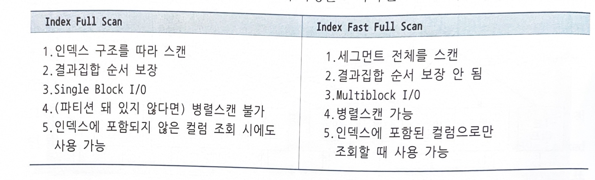

# 인덱스 확장기능 사용법

## Index Range Scan

- 인덱스 루트부터 리프 블록까지 수직적 탐색 -> 이후 필요한 범위만 스캔

## Index Full Scan

- 수직적 탐색 없이 인덱스 리프 블록을 처음부터 끝까지 수평적 탐색

```sql
select * from emp
where sal > 2000
order by ename
```

- 이 때, 인덱스는 ename, sal이라면 ename이 조건절에 없기 때문에 Range Scan은 불가능하지만 뒤쪽의 Sal칼럼이 Index Full Scan을 가능하게 해준다

### Index Full Scan의 효용성

- Range scan의 차선책이고, Table Full Scan 보다는 일부의 데이터를 탐색하기 때문에 성능이 좋을 가능성이 크다

## Index Unique Scan

- 수직적 탐색만으로 데이터를 찾는 방식이며 Unique 인덱스를 `=` 조건으로 탐색하는 경우이다.
- Unique 인덱스가 존재하는 컬럼은 중복 값을 DBMS가 데이터 정합성 관리
- 하지만 범위 검색이라면 Unique 인덱스도 Range Scan
- 또한 결합 인덱스일 때 일부 컬럼만으로 검색할 때도 범위 검색을 한다

## Index Skip Scan

- 오라클에서 사용, 인덱스 선두 컬럼이 조건절에 없어도 발동
- 인덱스 선두 컬럼의 Distinct Value 개수가 적고 후행 컬럼의 Distinct Value 개수가 많을 때 유용
    - 하지만 선두 컬럼에 대한 조건절은 있고, 중간 컬럼이 조건절에 없어도 사용 가능
    - Distinct Value가 적은 두 개의 선두 컬럼이 모두 조건절에 없어도 사용 가능
- 루트 또는 브랜치 블록에서 읽은 컬럼 값 정보를 이용해 조건절에 부합하는 레코드를 포함하는 **가능성 있는** 리프 블록만 골라 엑세스
- 스캔하다가 가능성이 없으면 skip한다.

## Index Fast Full Scan

- Index Full Scan보다 빠르다. 트리구조를 무시하고 인덱스 세그먼트를 Multiblock I/O 방식으로 스캔하기 때문
- 논리적 순서의 블록이 아닌 물리적 순서의 블록을 읽는다.
- 대량의 블록을 읽을 때 큰 효과를 발휘하나 인덱스 키 순서대로 정렬되지는 않는다.



## Index Range Scan Descending

- Index Range Scan과 동일하나 내림차순 정렬된 결과집합을 얻는다
- 기존 왼쪽 -> 오른쪽 스캔이 아닌 오른쪽 -> 왼쪽 스캔을 진행
- max 값을 구하고자 할 때도 인덱스를 뒤에서 한 건만 읽고 멈추는 실행계획 자동 수립