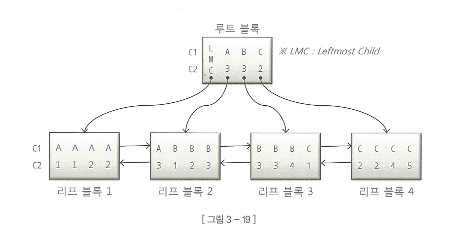

# 인덱스 스캔 효율화

## 인덱스 탐색



- 다시 복기하자면, 루트 및 브랜치 블록의 주소로 찾아간 블록에는 **자신의 키 값보다 크거나 같은 값**을 갖는 레코드가 저장
- A3으로 내려가면 자기보다 크거나 같은 리프 블록
- LMC로 내려가면 **키값을 가진 첫 번째 레코드(A3)보다 작거나 같은 값을 갖는다**
- 수직적 탐색은 **스캔 시작점**을 찾는 과정이다.

```sql
WHERE C1 BETWEEN 'A' AND 'C'
AND C2 BETWEEN 2 AND 3
```

- 해당 쿼리의 첫번재 조건절은 시작과 끝을 정해주었기 때문에 도움
- C2는 B구간에서 거의 쓰이지 못했다.
- 시작점을 물론, **끝점** 정해주는 것도 스캔량을 줄이는데 역할을 한다.

## 인덱스 스캔 효율성


```sql
WHERE c1 = '성'
WHERE c2 = '능'
WHERE c4 = '선'
```

- 해당 SQL이 full scan을 하는 이유는 c4의 인덱스 선행 컬럼인 `c3`에 대한 조건절이 없어서 그런다.
- 인덱스 선행 컬럼이 조건절에 없거나 `=` 조건이 아니면 인덱스 스캔 과정에 비효율 발생

## 엑세스 조건과 필터 조건

- 인덱스 엑세스 조건: 인덱스 스캔 범위를 결정하는 조건
    - 수직적 탐색
    - 스캔 시작점 결정
    - 리프 블록 스캔 후, 어디서 멈출지 결정
- 인덱스 필터 조건: 테이블로 엑세스 할지를 결정하는 조건 절
- 테이블 필터 조건: 쿼리 수행 다음 단계로 전달하거나 최종 결과집합에 포함될지 결정

## 비교 연산자 종류와 컬럼 순서에 따른 군집성

- 인덱스는 `같은 값`을 갖는 레코드들이 서로 군집되어 있음
- 앞에가 모두 `=` 조건일 때, 첫 번째 나타나는 범위검색 조건까지만 만족하는 인덱스 레코드들은 모두 모여있지만, 그 이하 조건까지 만족하는 레코드는 비교 연산자 종류에 상관없이 흩어진다
- 즉, 첫번째 범위 검색까지가 **인덱스 엑세스 조건**, 그 이후는 모두 **인덱스 필터 조건** 이다.

## 인덱스 선행 컬럼이 등치 조건이 아닐 때 생기는 비효율

인덱스 선두 컬럼에  만약 `BETWEEN`  연산자를 사용하게 되면 나머지 조건을 만족하는 레코드들이 뿔뿔이 흩어져 있게 되면서, 조건에 만족하지 않는 레코드까지 스캔을 하게 된다.

그래서 `BETWEEN` 연산자가 인덱스 선두 컬럼에 온다면 이것을 `In-List` 로 바꿔주면 `UNION ALL` 로 옵티마이저가 알아서 바꿔준다. 그렇게 되면 각 브랜치 마다 모든 컬럼을 `=`으로 검색하기 때문에 훨씬 효율적이다.

하지만  `In-List` 개수가 너무 많게 되면 수직적 탐색이 오히려 많아져서, 그냥 수평적 탐색을 하게 하는 것이 더 효율적일 때가 있다.

## BETWEEN을 IN-LIST로 전환

- 운영환경에서 인덱스를 바꾸기 쉽지 않다.
- BETWEEN 조건을 IN-List로 바꾸면 큰 효과가 이따.
- 인덱스 수직적 탐색이 N번 발생하게 된다.
    - 수직적 탐색을 하고 `UNION ALL`을 한 것과 마찬가지가 됨
- 개수가 많아지면 NL 조인이나 서브쿼리로 구현하라

### 주의 사항

- IN List 개수가 많지 않아야 한다.
- 루트에서 브랜드 블록까지 Depth가 깊어지면 수직적 탐색이 많아질 수록 안좋다.
- 따라서 In list 절 이후의 조건이 서로 가까이 있다면 굳이 In-List로 바꿔서 수직적 탐색을 늘릴 필요가 없다.


## In 조건은 = 인가?

당연히 `IN` 조건은 `=`과 다르다. WHERE 절에 다음과 같이 있다고 가정하자

```sql
WHERE 고객번호 = :cust_no
AND 상품ID in ('PROD1', 'PROD2', 'PROD3')
```

여기서 인덱스가 상품ID + 고객번호로 되어있다면, 리프노드에 상품ID 하나 당 고객번호가 들어가있다. 다행인 것은 상품ID 절이 `In-List` 로 풀어져있어서 세번의 수직적 탐색을 하게 된다.

반면 고객번호 + 상품 ID로 인덱스를 설정했을 때, 상품 ID를 `In-List` 로 풀지 않으면 필터 조건이 되며, 블록 IO는 총 네 번 발생한다. 이유는 한 블록에 고객번호에 맞는 상품ID들이 모여있기 때문이다.

따라서 오히려 고객별 상품데이터가 많지 않다면 `In-List` 보다는 필터 조건이 더 효율적일 때가 있다.

이유는 다음과 같다.

- 한 고객의 모든 상품 정보가 같은 블록에 있을 가능성 높음
- 한 번의 블록 접근으로 필요한 모든 데이터 확인 가능

## BETWEEN과 LIKE 스캔 범위 비교

- 날짜와 같은 검색은 개발 편의성을 위해 `LIKE` 를 쓰지 말고 `BETWEEN` 을 사용해라
    - 201913~ 으로 시작되는 것도 읽을 수 있기 때문

## 범위검색 조건을 남용할 때 생기는 비효율

- 인덱스 중간 컬럼에 대한 조건이 있을 때와 없을 때의 스캔 범위는 당연히 다르다.
- 하지만 이를 한번에 처리하려고 `LIKE` 절을 쓰게되면, 액세스 조건이던 컬럼이 필터 조건으로 변경되어서 스캔량이 늘어나게 된다.
- BEWEEN도 미친가지로 옵셔널을 처리하려고 사용하면 인덱스 스캔 효율이 매우 안좋아진다.

## 다양한 옵션 조건 처리 방식의 장단점 비교

### OR 조건 활용

- 인덱스 선두 컬럼에 대한 옵션 조건에 **OR 조건을 사용해서는 안된다. →** 인덱스를 사용하지 못한다. 근데 InnoDB인 Mysql에서는 가능 한 것 같다.
- OR 조건을 활용한 옵션 조건 처리
    - 인덱스 엑세스 조건으로 사용 불가
    - 인덱스 필터 조건으로도 사용 불가
    - 테이블 필터 조건으로만 사용 가능
- 즉, OR 조건을 사용한 옵션 처리 조건은 왠먄해서는 사용하지 말자.

### LIKE BETWEEN 조건 활용

- `상품분류 코드 like :prod_code || '%'`  는 인덱스 필터 조건으로 사용할 수 있다.
    - mysql에서는 CONCAT `WHERE 상품분류코드 LIKE CONCAT(:prod_code, '%');`
    - 그런데 만약 상품 분류코드가 NULL이면 Table Full Scan을 하게 될 것이다.
- LIKE/BETWEEN 패턴을 사용하고자 할 때 고려조건
    - 인덱스 선두 컬럼
        - 선두 컬럼을 입력하지 않으면 FULL SCAN
    - NULL 허용 컬럼
        - like나 between은 NULL을 누락시킨다.
    - 숫자형 컬럼
        - LIKE는 자동으로 형변환을 한다. 따라서 필터조건으로 변한다.
    - 가변 길이 컬럼
        - 이현과 이현제를 모두 검색하게 된다.

### UNION ALL 활용

- UNION ALL을 활용해서 두 개의 SQL 중 중간 컬럼 값이 있는지 없는 지에 따라서 선택하는 것이다.
- 코딩 길이가 길어지지만, 옵션 조건 컬럼도 인덱스 엑세스 조건으로 사용할 수 있다.

### NVL/DECODE 함수 활용

- 이 둘을 사용하면 UNION ALL처럼 옵션 조건 컬럼을 인덱스 엑세스 조건으로 사용할 수 있다는 것이다.
- 하지만 LIKE 패턴처럼 NULL 허용 컬럼에 사용할 수 없다.
- MySQL에서는 IS NULL OR 조건을 그대로 사용하는 것이 더 효율적이라고 한다.

## 함수호출부하 해소를 위한 인덱스 구성

### PL/SQL 함수의 성능적 특성

- PL/SQL 함수는 실행 시 매번 SQL 실행엔진과 PL/SQL 가상머신 사이에 컨텍스트 스위칭 발생
- 더군다나 가장 문제인 `Recursive Call` 발생
    - 함수에 SQL이 내장되어 있으면 해당 쿼리도 호출할 때마다 같이 호출이됨

### 효과적인 인덱스 구성을 통한 함수호출 최소화

- 인덱스를 잘 사용하자. Full Scan 방식이면 테이블 수만큼 함수의 추가 쿼리가 들어간다.
- 반면 잘 조정해서 테이블 엑세스 → 인덱스 필터 조건 → 인덱스 엑세스 조건으로 좁히면 함수는 더욱 더 조금 호출하게 할 수 있다.