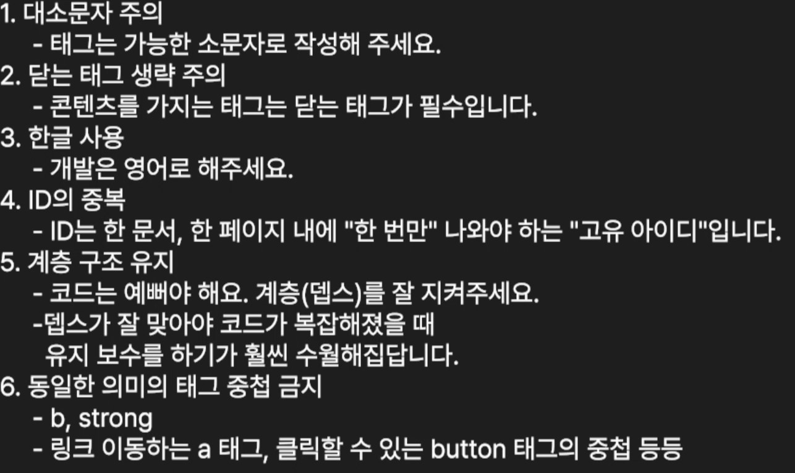

## 네임 태그
- section: 구역
- article: 글
- aside: 부가적인 정보
## 콘텐츠
- `<h1> ~ <h6>`
- `<b>`: 두껍게
- `<strong>`: 굵고 강조
- `<i>`: 기울기, 문단의 내용과 구분되어야 하는 경우
- `<em>`: 기울임과 동시에 강조
- `<u>`: 밑줄
- `<s>`, `<del>`: 취소선, del은 제거된 텍스트를 나타낸다.
- `<a>`: 외부 패이지로 보낸다, `target="_blank"`는 새 창으로 보내준다.
## 멀티미디어
- `<image src="" alt="하트">`
- `<figure>`로 img를 블록요소로 만들 수 있다.
- `<video poster=".png">`, `<source src="" type="video.mp4" />` 로 사용
- svg: 그래픽으로 만들어진 이미지
## 리스트
- `<ul>`의 하위는 `<li>`
- `<ol>`은 1, 2, 3 형식이고 이것의 하위도 `<li>`다.
- `<dl>`, `<dt>`, `<dd>`: dt와  dd는 키 값이다.
## 테이블
- `<table>` `<thead>` `<tr>` `<th>` 순서
- `<tbody>`, `<tfoot>` 도 있다.

## iframe
- 문서 안에 html을 불러오는 것

## form
- `<form>`과 액션, 

## 주의사항
