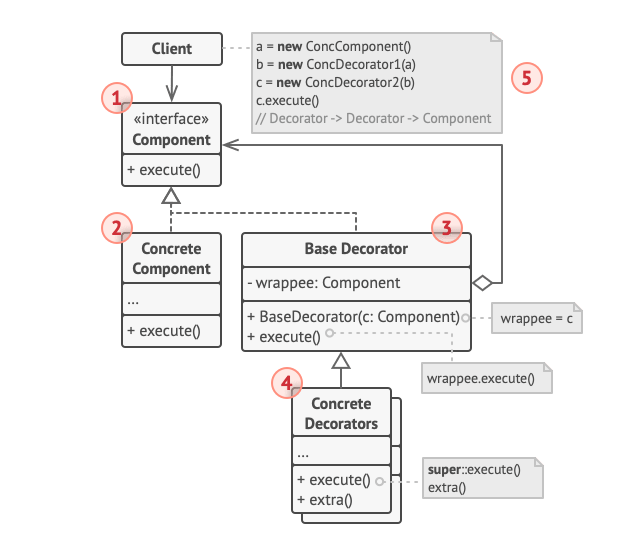
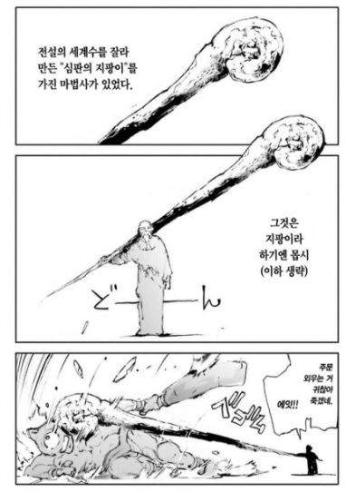

# 데코레이터 패턴

- 데코레이터 패턴(Decorator Pattern)은 객체에 추가적인 기능을 동적으로 첨가할 수 있도록 해주는 구조적 디자인 패턴
- 대상 객체에 확장, 변경이 필요할 때 객체의 결합을 통해 새로운 기능을 추가 가능



- Component: 원복 객체와 장식 객체를 모두 묶는다.
- ConcreteComponent: 데코레이팅 할 객체
- Decorator: 추상화된 데코레이터 객체, 래핑된 객체를 참조하는 필드가 있다. 또한 컴포넌트 인터페이스의 구현 메소드를 갖는다.
- ConcreteDecorator: 데코레이터 구현체, 부모의 컴포넌트를 호출하고, 부가적인 추가 로직이 있다.


## python 예제 코드

```python
from abc import ABC, abstractmethod

class Character(ABC):
    @abstractmethod
    def attack(self):
        pass

    @abstractmethod
    def magic_attack(self):
        pass

    @abstractmethod
    def get_description(self):
        pass

class Warrior(Character):
    def attack(self):
        return 10
    
    def magic_attack(self):
        return 0
    
    def get_description(self):
        return "물리 공격력이 강한 전사이다."

class Mage(Character):
    def attack(self):
        return 3
    
    def magic_attack(self):
        return 10
    
    def get_description(self):
        return "마법 공격력이 강한 마법사이다."
    
class CharacterDecorator(Character, ABC):
    def __init__(self, character):
        self._character = character

    @abstractmethod
    def attack(self):
        pass

    @abstractmethod
    def magic_attack(self):
        pass

    @abstractmethod
    def get_description(self):
        pass

class PowerStrikeDecorator(CharacterDecorator):
    def attack(self):
        return self._character.attack() + 15
    
    def magic_attack(self):
        return self._character.magic_attack()
    
    def get_description(self):
        return f"파워스트라이크 스킬을 가진 {self._character.get_description()}"
    
class EngergyBoltDecorator(CharacterDecorator):
    def attack(self):
        return self._character.attack()
    
    def magic_attack(self):
        return self._character.magic_attack() + 15
    
    def get_description(self):
        return f"에너지볼트 스킬을 가진 {self._character.get_description()}"
    
class FireChargeDecorator(CharacterDecorator):
    def attack(self):
        return self._character.attack()
    
    def magic_attack(self):
        return self._character.magic_attack() + 5
    
    def get_description(self):
        return f"파이어차지를 가진 {self._character.get_description()}"
    
    def set_elemental_attack(self):
        return "Fire"
```

- 데코레이터 패턴을 가장 잘 표현할 수 있을 것 같은 예시를 만들었다.
- RPG 게임에는 전사와 마법사 직업군이 존재하고, 각각에 맞는 스킬을 배울 수 있다.
- 전사는 물리 공격력이 강하고, 마법사는 마법 공격력이 강하다.
- 그리고, 직업군에 맞는 공격을 할 것이기에, 그에 맞는 스킬을 배워야 한다. 정석적인 스킬트리는 다음과 같다.

```python
if __name__ == "__main__":
    # 기본 전사 캐릭터 생성
    warrior = Warrior()
    print(f"{warrior.get_description()} 공격력: {warrior.attack()}, 마법 공격력: {warrior.magic_attack()}")

    # 파워 스트라이크가 추가된 전사
    power_strike_warrior = PowerStrikeDecorator(warrior)
    print(f"{power_strike_warrior.get_description()} 공격력: {power_strike_warrior.attack()}, 마법 공격력: {power_strike_warrior.magic_attack()}")

    # 기본 마법사 캐릭터 생성
    mage = Mage()
    print(f"{mage.get_description()} 공격력: {mage.attack()}, 마법 공격력: {mage.magic_attack()}")

    # 에너지 볼트가 추가된 마법사
    energy_bolt_mage = EngergyBoltDecorator(mage)
    print(f"{energy_bolt_mage.get_description()} 공격력: {energy_bolt_mage.attack()}, 마법 공격력: {energy_bolt_mage.magic_attack()}")
```

- 물리 공격력이 강한 전사는 물리 공격력이 강해진 상태로 공격하는 파워스트라이크, 마법사는 마법 공격력이 강해진 상태로 공격하는 에너지 볼트를 배웠다.

```
물리 공격력이 강한 전사이다. 공격력: 10, 마법 공격력: 0
파워스트라이크 스킬을 가진 물리 공격력이 강한 전사이다. 공격력: 25, 마법 공격력: 0

마법 공격력이 강한 마법사이다. 공격력: 3, 마법 공격력: 10
에너지볼트 스킬을 가진 마법 공격력이 강한 마법사이다. 공격력: 3, 마법 공격력: 25
```

- 하지만, 어느 게임이든 정상적인 육성을 하기보다는 자신만의 스킬 트리를 만들어내는 괴짜들이 존재한다.


<sub>[출처](https://post.naver.com/viewer/postView.naver?volumeNo=20450607&memberNo=810691)</sub>



<sub>[출처](https://www.dogdrip.net/277503803)</sub>

- 이렇게 어떤 마법사는 물리적으로 공격을 하고, 에너지 볼트도 사용하는 하이브리드 육성법으로 캐릭터를 키웠다.

```python

if __name__ == "__main__":
    # 파워 스트라이크가 추가된 마법사
    fire_charge_mage = PowerStrikeDecorator(energy_bolt_mage)
    print(f"{fire_charge_mage.get_description()} 공격력: {fire_charge_mage.attack()}, 마법 공격력: {fire_charge_mage.magic_attack()}")
```

```python
파워스트라이크 스킬을 가진 에너지볼트 스킬을 가진 마법 공격력이 강한 마법사이다. 공격력: 18, 마법 공격력: 25
```

- 또한, 마법 속성을 부여하여, 마법 추가 데미지를 주는 전사도 존재한다.

```python
    # 파이어 차지가 추가된 전사
    fire_charge_warrior = FireChargeDecorator(power_strike_warrior)
    print(f"{fire_charge_warrior.get_description()} 공격력: {fire_charge_warrior.attack()}, 마법 공격력: {fire_charge_warrior.magic_attack()}")

```

```
파이어차지를 가진 파워스트라이크 스킬을 가진 물리 공격력이 강한 전사이다. 공격력: 25, 마법 공격력: 5, 속성: Fire
```

## TradeOff
- 장점
    - `단일 책임의 원칙`, `개방 폐쇄의 원칙`, `의존 역전 원칙`을 잘 준수할 수 있다.
    - 서브 클래스를 만들어서 인스턴스화 하는 것 보다 유연한게 기능을 확장시킬 수 있다.
    - 데코레이터로 매핑해서 여러 동작을 결합 가능
- 단점
    - 생성자 코드가 예쁘지 않다.
    - 데코레이팅 순서에 따라서 순서가 달라지기에, 순서에 영향을 많이 받는다