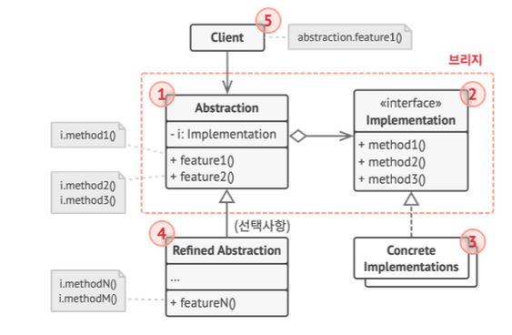

# 브리지 패턴




- `추상화`와 `구현`을 분리하여 독립적으로 변형할 수 있게 해준다.
    - 추상화: 고수준의 인터페이스. 예로 들면 모바일 기기(스마트폰, 태블릿)
    - 구현: 다양한 운영체제 (Android, IOS)
- 추상화는 구현에 선언된 메서들을 통해서 구현 객체와 소통 가능
- 모놀리식 클래스를 나누고 싶을 때 사용
- 한마디로 

## go 예시 코드

```go
// Abstraction: 모바일 기기 추상화

type MobileDevice struct {
	os OperatingSystem
}

func (m *MobileDevice) SetOS(os OperatingSystem) {
	m.os = os
}

func (m *MobileDevice) UseApp(app string) string {
	return m.os.RunApp(app)
}

// RefinedAbstraction: 구체적인 모바일 기기

type Smartphone struct {
	MobileDevice
}

func (s *Smartphone) UseApp(app string) string {
	return "Smartphone: " + s.MobileDevice.UseApp(app)
}

type Tablet struct {
	MobileDevice
}

func (t *Tablet) UseApp(app string) string {
	return "Tablet: " + t.MobileDevice.UseApp(app)
}

// Implementor 인터페이스: 운영 체제의 기능을 정의

type OperatingSystem interface {
	RunApp(app string) string
}

// ConcreteImplementor: 실제 운영 체제 구현체

type Android struct{}

func (a *Android) RunApp(app string) string {
	return "Running " + app + " on Android"
}

type iOS struct{}

func (i *iOS) RunApp(app string) string {
	return "Running " + app + " on iOS"
}

func main() {
	// Android 운영 체제를 사용하는 스마트폰
	androidPhone := &Smartphone{}
	androidPhone.SetOS(&Android{})
	fmt.Println(androidPhone.UseApp("WhatsApp"))

	// iOS 운영 체제를 사용하는 태블릿
	iOSTablet := &Tablet{}
	iOSTablet.SetOS(&iOS{})
	fmt.Println(iOSTablet.UseApp("Pages"))
}
```

- 만약 브릿지 패턴을 사용하지 않았으면, 다음과 같은 클라이언트 코드가 발생했다.
- 확장성이 매우 좋지 않음

```go
func main() {
	// Android 스마트폰에서 앱 실행
	androidPhone := &AndroidSmartphone{}
	fmt.Println(androidPhone.RunApp("WhatsApp"))

	// Android 태블릿에서 앱 실행
	androidTablet := &AndroidTablet{}
	fmt.Println(androidTablet.RunApp("YouTube"))

	// iOS 스마트폰에서 앱 실행
	iOSPhone := &iOSSmartphone{}
	fmt.Println(iOSPhone.RunApp("FaceTime"))

	// iOS 태블릿에서 앱 실행
	iOSTablet := &iOSTablet{}
	fmt.Println(iOSTablet.RunApp("Pages"))
}
```