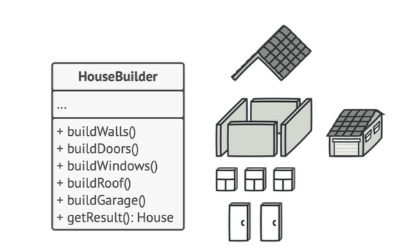
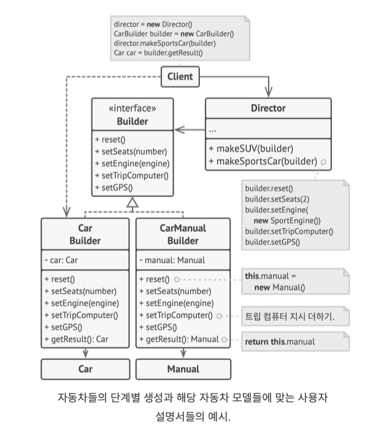

# 빌더 패턴

- 복잡한 객체를 단계별로 생성할 수 있도록 하는 패턴
- 집을 만드는 것을 생각해보자. 어떤 집은 창문이 있고, 문이 있다. 또한 문과 창문의 종류도 다르다.
- 간단하게 집을 생성할 때 모든 매개 변수를 포함한 생성자를 만들면 쓰이지 않는 매개변수가 너무 많아진다.



<sub>출처: refactoring.guru</sub>

- 해결방법
    - 빌더 클래스에 복잡한 객체들을 단계별로 생성한다.
    - 모든 단계를 호출할 필요가 없기에, 특정 객체를 제작하는데 필요한 단계만 호출한다.
- 디렉터라는 별도 관리자 클래스를 둬서 제작 단계의 실행 순서를 정의할 수 있다.



- 커스텀 자동차 = 클라이언트가 직접 빌더 사용
- 인기 자동차 = 디렉터에게 빌더 사용을 위임
- 사용설명서는 기본 제작 프로세스와 인터페이스를 공유한다. 즉 부품을 **제작** 하는 것이 아니라 **설명** 을 한다.

## 언제 써야하는가?

- 선택적으로 넣는 매개변수가 많을 때
- 세부 사항만 다른(ex: 스포츠카, SUV) 유사한 단계를 포함할 때
- 모든 제품이 인터페이스에 따르는 경우만 디렉터 사용 가능
- 비지니스 로직에서 복잡한 생성 코드를 분리시킬 수 있다. = `단일 책임의 원칙`

## 추상 팩토리와의 관계

- 빌더: 복잡한 객체를 단계별로 생성하는데 중점
- 추상 팩토리: 관련된 객체들의 패밀리를 생성하는데 중점

## go 예시 코드

```go
package main
import "fmt"

type Car struct {
	Seats int
	Engine string
	TripComputer bool
	GPS bool
}

type Manual struct {
	Seats string
	Engine string
	TripComputer string
	GPS string
}

type Builder interface {
	Reset()
	SetSeats(seats int)
	SetEngine(engine string)
	SetTripComputer(tripComputer bool)
	SetGPS(gps bool)
}

type CarBuilder struct {
	car *Car
}

func NewCarBuilder() *CarBuilder {
	cb := &CarBuilder{}
	cb.Reset()
	return cb
}

func (cb *CarBuilder) Reset() {
	cb.car = &Car{}
}

func (cb *CarBuilder) SetSeats(seats int) {
	cb.car.Seats = seats
}

func (cb *CarBuilder) SetEngine(engine string) {
	cb.car.Engine = engine
}

func (cb *CarBuilder) SetTripComputer(tripComputer bool) {
	cb.car.TripComputer = tripComputer
}

func (cb *CarBuilder) SetGPS(gps bool) {
	cb.car.GPS = gps
}

func (cb *CarBuilder) GetProduct() *Car {
	product := cb.car
	cb.Reset()
	return product
}

type CarManualBuilder struct {
	manual *Manual
}

func NewCarManualBuilder() *CarManualBuilder {
	mb := &CarManualBuilder{}
	mb.Reset()
	return mb
}

func (mb *CarManualBuilder) Reset() {
	mb.manual = &Manual{}
}

func (mb *CarManualBuilder) SetSeats(seats int) {
	mb.manual.Seats = fmt.Sprintf("이 차에는 %d개의 시트가 있습니다.", seats)
}

func (mb *CarManualBuilder) SetEngine(engine string) {
	mb.manual.Engine = fmt.Sprintf("이 차의 엔진은 %s 입니다.", engine)
}

func (mb *CarManualBuilder) SetTripComputer(tripComputer bool) {
	if tripComputer {
		mb.manual.TripComputer = "트팁 컴퓨터가 존재합니다."
	} else {
		mb.manual.TripComputer = "트립 컴퓨터가 없습니다."
	}
}

func (mb *CarManualBuilder) SetGPS(gps bool) {
	if gps {
		mb.manual.GPS = "해당 차에는 GPS 기능이 있습니다."
	} else {
		mb.manual.GPS = "GPS 기능이 탑재되어있지 않습니다."
	}
}

func (mb *CarManualBuilder) GetProduct() *Manual {
	product := mb.manual
	mb.Reset()
	return product
}

type Director struct{}

func (d Director) ConstructSportsCar(builder Builder) {
	builder.Reset()
	builder.SetSeats(2)
	builder.SetEngine("SprotsEngine")
	builder.SetTripComputer(true)
	builder.SetGPS(true)
}

func (d Director) ConstructSUV(builder Builder) {
	builder.Reset()
	builder.SetSeats(5)
	builder.SetEngine("SUVEngine")
	builder.SetTripComputer(true)
	builder.SetGPS(true)
}

type Application struct {}

func (app *Application) MakeCar() {
	director := &Director{}

	carBuilder := &CarBuilder{}
	director.ConstructSportsCar(carBuilder)
	car := carBuilder.GetProduct()
	fmt.Printf("Car built:\n %+v\n", car)

    manualBuilder := &CarManualBuilder{}
    director.ConstructSportsCar(manualBuilder)
    manual := manualBuilder.GetProduct()
    fmt.Printf("Car manual built:\n %+v\n", manual)
} 

func main() {
    app := &Application{}
    app.MakeCar()
}
```