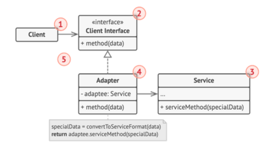

# 어댑터 패턴



- 서로 호환되지 않는 인터페이스를 가진 클래스들을 연결해주는 디자인 패턴
    - 즉, 기존 클래스를 사용하고 싶지만, 그 인터페이스가 나머지 코드와 호환되지 않을 때 사용
    - 변환기 역할을 하는 중간 레이어 클래스이다
- 클라이언트: 기존 비즈니스 로직을 포함하는 클래스
- 클라이언트 인터페이스: 다른 클래스들이 클라이언트와 상호작용할 수 있도록 정의된 프로토콜
- 서비스: 타사 또는 레거시 클래스로, 클라이언트가 직접 사용할 수 없는 호환되지 않는 인터페이스를 가짐
- 어댑터: 클라이언트와 서비스 간의 연결 역할을 하며, 클라이언트 인터페이스를 구현합니다. 어댑터는 클라이언트의 호출을 서비스가 이해할 수 있는 형식으로 변환
- 유연성: 클라이언트 코드는 어댑터와 작업하지만 구체적인 어댑터 클래스와 결합하지 않아, 새로운 어댑터를 추가해도 기존 코드를 변경할 필요가 없음

> 요약하자면 Adapter는 client interface를 구현, Adapter의 구현체는 연결하고자하는 service가 있고, 구현체의 메서드는 해당 서비스의 메서드를 호출한다.

## GO 예시

```go
package main

import "fmt"

type ClientInterface interface {
	PerformOperation()
}

type LegacyService struct{}

func (s *LegacyService) LegacyOperation() {
	fmt.Println("LegacyService: Performing legacy operation.")
}


type Adapter struct {
	service *LegacyService
}

func (a *Adapter) PerformOperation() {
	fmt.Println("Adapter: Adapting request to LegacyService...")
	a.service.LegacyOperation()
}


type Client struct {
	adapter ClientInterface
}

func (c *Client) Execute() {
	c.adapter.PerformOperation()
}

func main() {
	legacyService := &LegacyService{}
	
	adapter := &Adapter{service: legacyService}
	
	client := &Client{adapter: adapter}
	
	client.Execute()
}

```