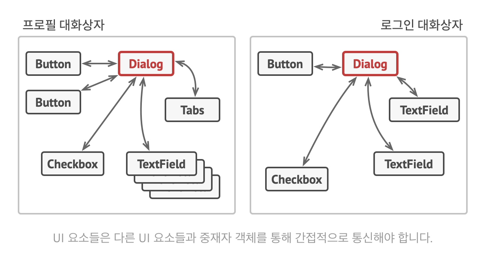
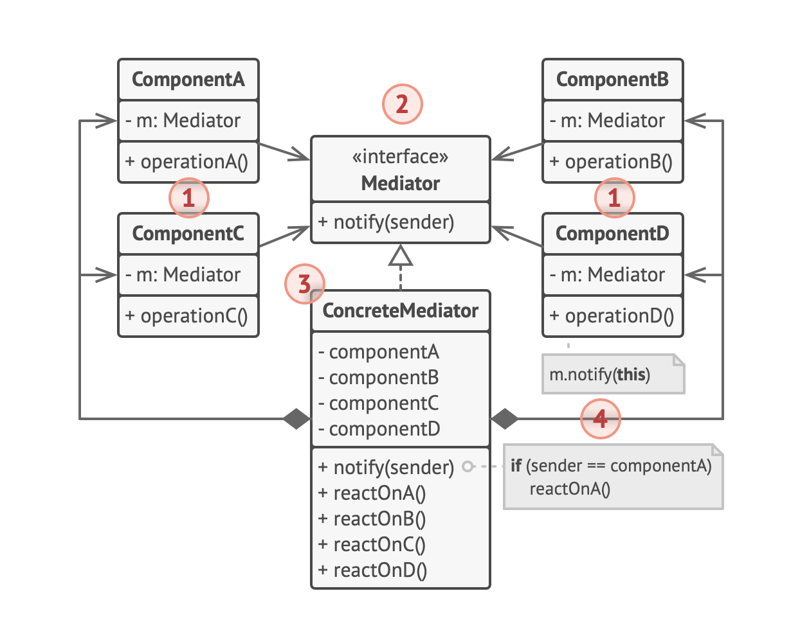

# 중재자 패턴

- 객체 간의 복잡한 상호작용을 캡슐화하여 객체 간의 결합도를 낮추는 패턴
- 객체 간의 상호작용을 중재자 객체로 캡슐화하여 객체 간의 결합도를 낮추고, 객체의 재사용성과 확장성을 높인다.


- 애플리케이션이 복잡해짐에 따라서 여러가지 버튼이 생성되고 각각의 버튼들이 서로 통신하게 된다.
- 이러한 상황에서 버튼들이 직접 서로 통신하게 되면 버튼들 간의 결합도가 높아지고 하나의 버튼이 변경될 때 다른 버튼들도 함께 변경되어야 한다.
- 이를 해결하기 위해 중재자 패턴을 사용한다.


<sub>출처: refactoring.guru</sub>

- 

## 파이썬 예시 코드

```python
from abc import ABC, abstractmethod
import asyncio
from fastapi import FastAPI, WebSocket, Depends
from typing import List, Annotated

app = FastAPI()

class ChatComponent(ABC):
    def __init__(self, mediator):
        self._mediator = mediator

    @abstractmethod
    async def send(self, message: str):
        pass

    @abstractmethod
    async def receive(self, message: str):
        pass

class ChatUser(ChatComponent):
    def __init__(self, mediator, name: str, websocket: WebSocket):
        super().__init__(mediator)
        self.name = name
        self.websocket = websocket

    async def send(self, message: str):
        await self._mediator.broadcast(f"{self.name}: {message}", self)

    async def receive(self, message: str):
        await self.websocket.send_text(message)

class ChatMediator(ABC):
    @abstractmethod
    async def broadcast(self, message: str, sender: ChatComponent):
        pass

class ChatRoom(ChatMediator):
    def __init__(self):
        self.users: List[ChatUser] = []

    async def broadcast(self, message: str, sender: ChatComponent):
        for user in self.users:
            print(self.users)
            if user != sender:
                await user.receive(message)

    def add_user(self, user: ChatUser):
        self.users.append(user)

    def remove_user(self, user: ChatUser):
        self.users.remove(user)

chat_room = ChatRoom()

@app.websocket("/ws/{client_name}")
async def websocket_endpoint(
        websocket: WebSocket,
        client_name: str
    ):
    await websocket.accept()
    user = ChatUser(chat_room, client_name, websocket)
    chat_room.add_user(user)
    try:
        while True:
            data = await websocket.receive_text()
            await user.send(data)
    except asyncio.CancelledError:
        chat_room.remove_user(user)

if __name__ == "__main__":
    import uvicorn
    uvicorn.run(app, host="0.0.0.0", port=8000)
```