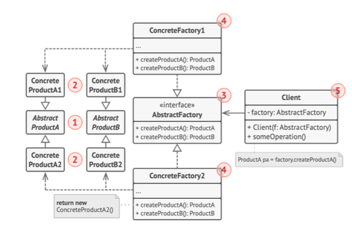
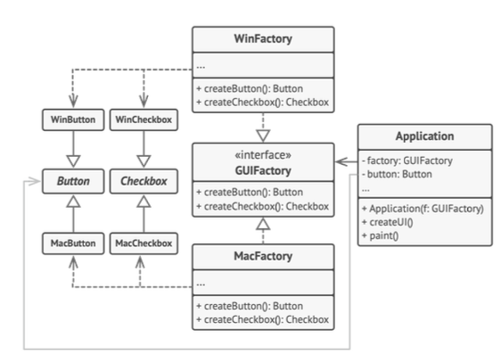

# 팩토리 메서드 패턴

- 여러 스타일(또는 제품군)의 객체를 생성하는데, 각 스타일에 맞는 구체적인 클래스를 직접 코드에 작성하지 않고, 인터페이스를 통해 객체를 생성하게 한다.
- 새로운 스타일이 추가되더라도 기존 코드를 수정할 필요 없이 새로운 팩토리 클래스를 추가하기만 하면 된다.
- 단일 책임의 원칙과 개방/패쇄의 원칙을 지킬 수 있다.
- 팩토리에서 생성되는 제품들의 **호환성**을 보장할 수 있다.


<sub>출처: refactoring.guru</sub>

- Abstract Product: 개별 연관 제품들의 집합에 대한 인터페이스
- Concrete Product: abstract product의 구현체
- Abstract Factory: Concrete Product를 생성하기 위한 여러 메서드 집합 선언
- Concrete Factory: 추상 팩토리의 생성 메서드들을 구현한다.



## go 예시 코드

```go
package main

import "fmt"

type Button interface {
    Paint()
}

type Checkbox interface {
    Paint()
}

type WinButton struct {}

func (b *WinButton) Paint() {
    fmt.Println("윈도우 버튼 칠하기")
}

type MacButton struct {}

func (b *MacButton) Paint() {
    fmt.Println("맥 버튼 칠하기")
}

type WinCheckbox struct {}

func (c *WinCheckbox) Paint() {
    fmt.Println("윈도우 체크박스 칠하기")
}

type MacCheckbox struct {}

func (c *MacCheckbox) Paint() {
    fmt.Println("맥 체크박스 칠하기")
}

type GUIFactory interface {
    CreateButton() Button
    CreateCheckbox() Checkbox
}

type WinFactory struct{}

func (f *WinFactory) CreateButton() Button {
    return &WinButton{}
}

func (f *WinFactory) CreateCheckbox() Checkbox {
    return &WinCheckbox{}
}

type MacFactory struct{}

func (f *MacFactory) CreateButton() Button {
    return &MacButton{}
}

func (f *MacFactory) CreateCheckbox() Checkbox {
    return &MacCheckbox{}
}

type Application struct {
    factory GUIFactory
    button Button
}

func (app *Application) CreateUI() {
    app.button = app.factory.CreateButton()
}

func (app *Application) Paint() {
    app.button.Paint()
}

func main() {
    var factory GUIFactory

    os := "Mac"
    if os == "Windows" {
        factory = &WinFactory{}
    } else if os == "Mac" {
        factory = &MacFactory{}
    } else {
        panic("알 수 없는 운영체제")
    }

    app := &Application{factory: factory}
    app.CreateUI()
    app.Paint()
}
```

## 언제 사용해야 하는가?

- 시스템이 다양한 제품군을 지원해야 하지만 클라이언트 코드가 특정 제품군의 구체적인 클래스에 의존하지 않도록 하고 싶을 때
    - 새로운 제품군이 추가되어도 팩토리 클래스만 하나 추가하면 된다.
    - ex) 위의 예에서 리눅스에 지원해야 한다면? 밑과 같은 리눅스 팩토리만 생성해주면 된다.

    ```go
    type LinuxFactory struct {}

    func (f *LinuxFactory) CreateButton() Button {
        return &LinuxButton{}
    }

    funx (f *LinuxFactory) CraeteCheckbox() Checkbox {
        return &LinuxCheckbox{}
    }
    ```

    - 즉 관련성 있는 여러 종류의 객체를 **일관성** 있게 생성해주고 싶을 때

- 객체를 생성할 때 구현체 보다 추상 클래스 만을 이용해 객체를 생성하고자 할 때
- 객체 생성 로직이 복잡하고 다양한 변형이 필요할 때

### 깨알 Go 상식

> - Go에서는 인터페이스를 명시적으로 `상속`하지 않지만, 인터페이스에 정의된 모든 메서드를 구현함으로써 그 인터페이스를 만족
> - 인터페이스 타입의 변수에 구현체를 할당하려면 해당 구조체가 인터페이스의 모든 메서드를 구현해야 한다.