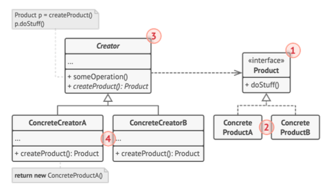

# 팩토리 메서드 패턴


<sub>출처: refactoring.guru</sub>

- `Product`: 인터페이스 선언
- `Concrete`: 인터페이스의 다양한 구현
- `Creator`
    - 새로운 Product 객체들을 반환하는 팩토리 메서드 선언
    - 이는 Product 인터페이스와 반환 유형이 일치해야 한다.
    - 팩토리 메서드를 추상 메서드로 만들어서 자식들의 구현을 강제할 수 있다.
    - 주책임은 Product를 생성하는 것이 아니라 핵심 비지니스 로직이다. 팩토리 메소드는 구체적인 Product의 생성 로직을 분리하는 역할을 한다.
- `ConcreteCreator`: 추상 팩토리 메서드를 오버라이드하여 다른 유형의 제품을 반환하게 한다

## go 예시 코드

```go
package main

import "fmt"

// Product 인터페이스 정의
type Product interface {
    doStuff() string
}

// ConcreteProductA 정의
type ConcreteProductA struct{}

func (p *ConcreteProductA) doStuff() string {
    return "Do Stuff Product A"
}

// ConcreteProductB 정의
type ConcreteProductB struct{}

func (p *ConcreteProductB) doStuff() string {
    return "Using Product B"
}

// Creator 인터페이스 정의
type Creator interface {
    CreateProduct() Product
}

// ConcreteCreatorA 정의
type ConcreteCreatorA struct{}

func (c *ConcreteCreatorA) CreateProduct() Product {
    return &ConcreteProductA{}
}

// ConcreteCreatorB 정의
type ConcreteCreatorB struct{}

func (c *ConcreteCreatorB) CreateProduct() Product {
    return &ConcreteProductB{}
}

func main() {
    var creator Creator

    creator = &ConcreteCreatorA{}
    productA := creator.CreateProduct()
    fmt.Println(productA.doStuff())

    creator = &ConcreteCreatorB{}
    productB := creator.CreateProduct()
    fmt.Println(productB.doStuff())
}
```

- 팩토리 패턴을 한 마디로 정의하면 다음과 같다.

> 팩토리 패턴은 객체 생성의 책임을 다른 클래스에 위임하는 디자인 패턴이다. 이를 통해 객체 생성 로직을 분리하고, 클라이언트 코드가 객체 생성 방식에 대해 신경 쓰지 않도록 한다.