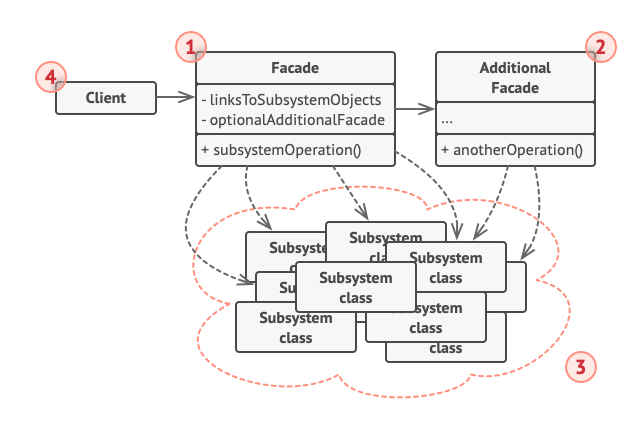
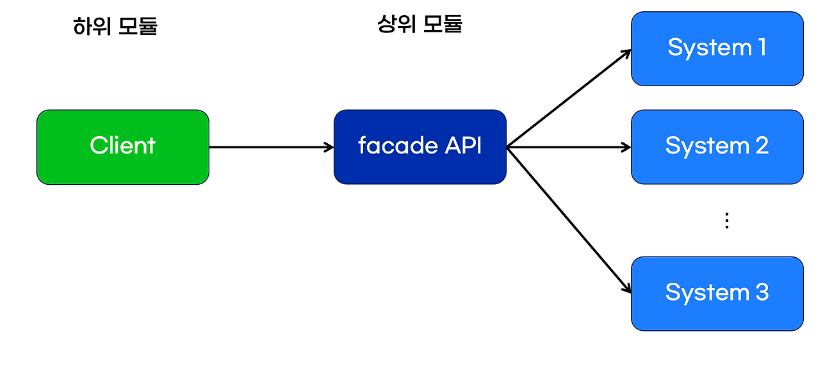

# 퍼사드 패턴



- 퍼사드 패턴(Facade Pattern)은 복잡한 시스템의 인터페이스를 단순화하여 사용자가 쉽게 접근할 수 있도록 도와주는 구조적 디자인 패턴
- 여러 개의 클래스나 서브시스템을 통합하여 간단한 인터페이스를 제공함으로써, 클라이언트가 시스템의 내부 구조를 몰라도 쉽게 사용할 수 있게 해준다.

> 여담으로 Facade는 건축물의 정면을 의미하여, 건축물의 정면만 봐도 이 건물이 이떤 건물이고, 목적은 무엇인지 한번에 알 수 있다는 의미에서 가져왔다.

## Go 예시 코드

```go
package main

import "fmt"

// 서브시스템 클래스들
type Amplifier struct{}
func (a *Amplifier) On() {
    fmt.Println("Amplifier on")
}
func (a *Amplifier) Off() {
    fmt.Println("Amplifier off")
}

type DVDPlayer struct{}
func (d *DVDPlayer) On() {
    fmt.Println("DVD Player on")
}
func (d *DVDPlayer) Play(movie string) {
    fmt.Println("Playing movie:", movie)
}
func (d *DVDPlayer) Stop() {
    fmt.Println("Stopping movie")
}
func (d *DVDPlayer) Off() {
    fmt.Println("DVD Player off")
}

type Projector struct{}
func (p *Projector) On() {
    fmt.Println("Projector on")
}
func (p *Projector) Off() {
    fmt.Println("Projector off")
}

// 퍼사드 클래스
type HomeTheaterFacade struct {
    amp      *Amplifier
    dvd      *DVDPlayer
    projector *Projector
}

func NewHomeTheaterFacade(amp *Amplifier, dvd *DVDPlayer, projector *Projector) *HomeTheaterFacade {
    return &HomeTheaterFacade{amp: amp, dvd: dvd, projector: projector}
}

func (h *HomeTheaterFacade) WatchMovie(movie string) {
    fmt.Println("Get ready to watch a movie...")
    h.projector.On()
    h.amp.On()
    h.dvd.On()
    h.dvd.Play(movie)
}

func (h *HomeTheaterFacade) EndMovie() {
    fmt.Println("Shutting movie theater down...")
    h.dvd.Stop()
    h.amp.Off()
    h.projector.Off()
}

// 클라이언트 코드
func main() {
    amp := &Amplifier{}
    dvd := &DVDPlayer{}
    projector := &Projector{}
    
    homeTheater := NewHomeTheaterFacade(amp, dvd, projector)

    homeTheater.WatchMovie("Inception")
    homeTheater.EndMovie()
}

```

- 예시는 집에서 영화를 보려고 할 때, 준비를 하는 과정을 설명한다.
- 영화를 보기 위해서는 앰프를 키고, DVD플레이어와 프로젝터를 켜야 한다.
- 즉, 여기서는 `Amplifier`, `DVDPlayer`, `Projector`는 각각의 기능을 가진 서브시스템 클래스이다.
- `HomeTheaterFacade`는 서브 시스템 클래스를 조합하여 클라이언트가 해당 클래스만 사용하여 영화를 볼 수 있는 간단한 인터페이스를 제공한다.
- 만약에 퍼사드 패턴을 사용하지 않으면, 클라이언트는 각 서브시스템 클래스를 직접 인스턴스화하고 메서드를 호출하여, 복잡해진다.
- 즉, 개발자가 실수할 가능성이 커진다.

```go
func main() {
    // 각 서브시스템을 직접 인스턴스화하고 메서드를 호출하는 경우
    amp := &Amplifier{}
    dvd := &DVDPlayer{}
    projector := &Projector{}

    // 영화를 보기 위해 필요한 모든 단계를 직접 수행해야 함
    fmt.Println("Get ready to watch a movie...")
    projector.On()   // 프로젝터 켜기
    amp.On()         // 앰프 켜기
    dvd.On()         // DVD 플레이어 켜기
    dvd.Play("Inception") // 영화 재생

    // 영화를 본 후 종료하는 단계
    fmt.Println("Shutting movie theater down...")
    dvd.Stop()       // 영화 정지
    amp.Off()        // 앰프 끄기
    projector.Off()  // 프로젝터 끄기
}
```

## Trade Off

- 장점
    - 코드의 가독성 향상
    - 유지보수 용이: 서브시스템의 변경이 클라이언트 코드에 미치는 영향을 최소화
    - 의존성 감소: 클라이언트는 서브시스템에 직접 의존하지 않고 퍼사드에 의존
- 단점
    - 복잡성
    - 추가적인 코드

## 퍼사드 API

[지마켓 블로그](https://dev.gmarket.com/84) 를 보고, 필요한 부분 발췌했습니다.


<sub> 출처: 지마켓 기술 블로그 </sub>

### 의존성 역전

- 기존의 상위 모듈에 해당했던 클라이언트가 facade API 가 추가되면서 상대적인 하위 모듈 역할을 함
- facade API 는 클라이언트의 요청을 받아, 백엔드 시스템의 서브시스템 조정, 클라이언트와 백엔드의 중재자 역할이기 때문
- 즉, 하위 -> 상위의 의존관계 역전이 일어남

### 유지보수 용이

- 의존 관계의 역전이 일어나면서 유지보수가 용이해진다.

```java
// 상품 정보를 담고 있는 클래스
// 시스템의 하위 수준에 있으며 구체적인 내용에 해당하는 하위 모듈
class Item {
    public List<Item> getItemLists() {  
        return new ArrayList<Item>();   // 빈 리스트가 아닌 아이템이 있는 리스트로 가정
    }
}

// 상품을 표시하는 페이지 관련 클래스
// 시스템의 상위 수준에 있으며 비즈니스 로직에 해당하는 상위 모듈
class Page {
    public void generatePage() {
        Item item = new Item();

        // List<item> 형식의 리스트를 순회
        List<Item> itemList = item.getItemLists();  

        for (Item i : itemList) {
            // 각각의 아이템 페이지 추가
        }
    }
}
```
- 여기에서 각각의 사용자 요청이 많아짐에 따라, 중복된 상품을 변경해야 하여 HashSet을 사용해야 하는 변경점 발생

```java
class Item {
    public Set<Item> getItemLists() {
        return new HashSet<Item>();
    }
}
```

- 이렇게 `Item` 리스트를 HashSet을 반환하도록 변경하면

```java
class Page {
    public void generatePage() {
        Item item = new Item();
        // 변경된 부분 : List<Item> itemList -> Set<Item> itemSet
        Set<Item> itemSet = item.getItemLists();

        for (Item i : itemSet) {
            // 각각의 아이템 페이지 추가
        }
    }
}
```

- 상위 모듈인 `generatePage()`의 반환 타입이 변경되어야 한다.
- 하지만 facade API를 사용하면 아래와 같이 변경 가능하다.

```java
// 상품 정보를 담고 있는 클래스
// Page 클래스와 비교했을때는 상위 모듈이지만, Facade 클래스에 비교했을 때는 하위 모듈
class Item {
    public Set<Item> getItemLists() {
        // 새 HashSet<Item>을 반환합니다.
        return new HashSet<Item>();
    }
}

// facade API 클래스
// Page 클래스의 상위 모듈
class Facade {
    public List<Item> getItemLists() {
        // HashSet인 getItemLists()를 List<Item>으로 변환해서 내려줌
    }
}

// 상품을 표시하는 페이지 관련 클래스
class Page {
    public void generatePage() {
        Facade facade = new Facade();
        List<Item> itemList = facade.getItemLists();
        for (Item i : itemList) {
            // 각각의 아이템 페이지 추가
        }
    }
}
```

- 이제 Facade가 상위 모듈이 되고, `getItemLists` 에서 HashSet을 List로 변환해 주면서, 하위 모듈의 변경이 그 위의 상위 모듈에 영향을 받지 않게 할 수 있다.
- 프로젝트 단위가 커질 때, 이러한 facade API를 두어서 변경점이 있을 때 facade API의 수정만 함


### 실제 지마켓은 facadeAPI를 이렇게 활용하고 있다.

- 백엔드에서 웹, 앱에 보내줄 데이터를 통합 및 가공(템플릿 형태) 하여 앱과 앱이 동시에 전달
- 중간 계층에 위치하여 응답을 표준화 한다.
- facadeAPI는 여러 API를 호출해야 하므로 속도가 중요
    - async, non-blocking
    - Node js, Spring Webflux 사용