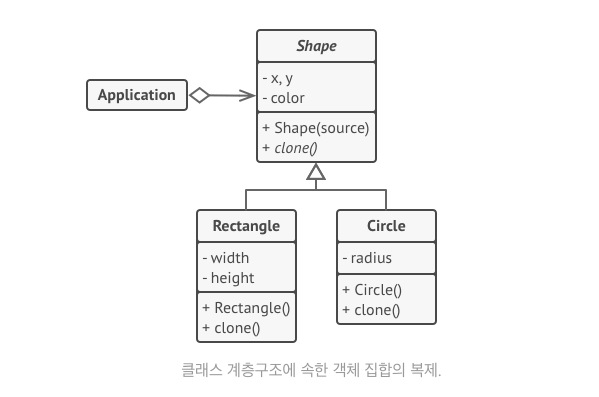
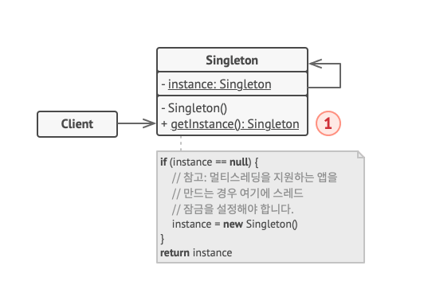

# 프로토타입, 싱글턴 패턴

## 프로토타입 패턴

- 한마디로 정의하면 **구체 클래스에 의존하지 않고 기존 객체를 복사할 수 있도록 하는 생성 디자인 패턴** 이다.
- 인터페이스에 `clone()` 메서드를 포함시키고, 객체가 필요할 경우 새 객체를 생성하는 것이 아니라 clone 메서드를 통해서 복제를 시킨다.



- Rectangle과 Circle은 clone을 통해서 자신을 복제하기전, 부모 클래스의 필드 값을 복제하기 위해 부모의 복제 메서드를 호출할 수도 있다. ex) 파이썬 `super()`

### go 예제 코드

```go
package main

import (
    "fmt"
)

type Shape interface {
    Clone() Shape
}

type BaseShape struct {
    X     int
    Y     int
    Color string
}

func (b *BaseShape) Clone() *BaseShape {
    return &BaseShape{
        X:     b.X,
        Y:     b.Y,
        Color: b.Color,
    }
}

type Rectangle struct {
    *BaseShape
    Width  int
    Height int
}

func NewRectangle() *Rectangle {
    return &Rectangle{
        BaseShape: &BaseShape{},
    }
}

func (r *Rectangle) Clone() Shape {
    return &Rectangle{
        BaseShape: r.BaseShape.Clone(),
        Width:     r.Width,
        Height:    r.Height,
    }
}

type Circle struct {
    *BaseShape
    Radius int
}

func NewCircle() *Circle {
    return &Circle{
        BaseShape: &BaseShape{},
    }
}

func (c *Circle) Clone() Shape {
    return &Circle{
        BaseShape: c.BaseShape.Clone(),
        Radius:    c.Radius,
    }
}

type Application struct {
    shapes []Shape
}

func NewApplication() *Application {
    app := &Application{}

    circle := NewCircle()
    circle.X = 10
    circle.Y = 10
    circle.Radius = 20
    app.shapes = append(app.shapes, circle)

    anotherCircle := circle.Clone()
    app.shapes = append(app.shapes, anotherCircle)

    rectangle := NewRectangle()
    rectangle.X = 20
    rectangle.Y = 30
    rectangle.Width = 10
    rectangle.Height = 20
    app.shapes = append(app.shapes, rectangle)

    return app
}

func (app *Application) BusinessLogic() {
    shapesCopy := make([]Shape, 0)

    for _, s := range app.shapes {
        shapesCopy = append(shapesCopy, s.Clone())
    }

    for _, s := range shapesCopy {
        switch shape := s.(type) {
        case *Circle:
            fmt.Printf("Circle - X: %d, Y: %d, Radius: %d\n", shape.X, shape.Y, shape.Radius)
        case *Rectangle:
            fmt.Printf("Rectangle - X: %d, Y: %d, Width: %d, Height: %d\n", shape.X, shape.Y, shape.Width, shape.Height)
        }
    }
}

func main() {
    app := NewApplication()
    app.BusinessLogic()
}

```

## 싱글턴 패턴

- **클래스에 인스턴스가 하나만 있도록 하고, 이 인스턴스에 대해서 전역 접근 지점을 제공하는 패턴**
    - 전역 접근 지점을 제공한다란, 전역 변수는 프로그램의 어떤 부분에서 접근 가능하여 여러 곳에서 이를 수정할 수 있다. 하지만 싱글턴 패턴에서는 이 인스턴스를 덮어쓰거나 변경할 수 없게하여 데이터 무결성을 보호한다.
- 구현 방법
    - 싱글턴 클래스에서 new 연산자를 사용하지 못하도록 기본 생성자를 Private으로 설정
    - 생성자 역할을 하는 정적 생성 메서드 생성. 메서드에서는 Private 생성자를 호출하고 객체를 정적 필드에 저장한다.

### 파이썬 예시 코드

```python
class UserManager:
    _instance = None

    def __new__(cls):
        if cls._instance is None:
            cls._instance = super().__new__(cls)
            cls._instance.users = []
        return cls._instance

    def add_user(self, user):
        self.users.append(user)

    def get_users(self):
        return self.users


if __name__ == "__main__":
    user_manager1 = UserManager()
    user_manager2 = UserManager()

    user_manager1.add_user("Alice")
    user_manager1.add_user("Bob")

    print(user_manager1.get_users())  # ['Alice', 'Bob']
    print(user_manager2.get_users())  # ['Alice', 'Bob']

    print(user_manager1 is user_manager2)  # True (같은 인스턴스임을 확인)

```

- `cls._instance = super(UserManager, cls).__new__(cls)` 는 다음과 같다.
    - `super()`는 부모 클래스의 메서드를 호출하는 함수로, 여기서는 UserManager의 부모 클래스인 object의 `__new__` 메서드를 호출한다.
    - `__new__(cls)`는 새로운 인스턴스를 생성하고, 이를 클래스 변수인 _instance에 저장한다.
    - `__new__` 는 `__init__` 보다 먼저 실행되며, 클래스 자기 자신을 파라미터로 받고 object를 return한다.



### go 예시 코드

```go
package main

import (
    "sync"
)

type Database struct {
}

var instance *Database
var once sync.Once

func GetInstance() *Database {
    once.Do(func() {
        instance = &Database{}
    })
    return instance
}

func (db *Database) Query(sql string) {
    // 데이터베이스 쿼리 로직
}

func main() {
    db1 := GetInstance()
    db1.Query("SELECT * FROM users")

    db2 := GetInstance()
    db2.Query("SELECT * FROM orders")

    if db1 == db2 {
        println("db1 and db2 are the same instance.")
    }
}
```